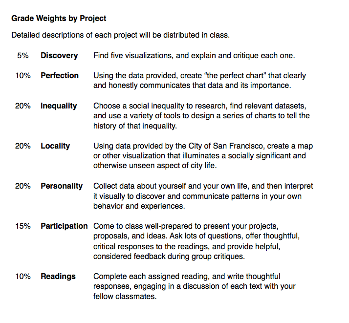

# Experimental Course Outline: Data Viz

## Overview
The idea of the data viz course is to go go through Ben Fry's data visualization pipeline: 

 aquire --> parse --> filter --> mine --> represent --> refine --> interact 
 

The course focuses on each aspect of the pipeline, exposing the students to data viz **tools** (from parsing - R/Python, commandline tools - to interacting - Mapbox Studio/Leaflet) and basic user experience/interaction **design principles** (journal articles, readings and discussion). 

## Learning Objectives
The learning objectives of the course would be for students to:

1. To learn the fundamentals of effective visualization
2. To develop a critical eye for visualization - to appreciate the responsibility, power, and danger embedded in visualization
3. To develop problem solving skills 
4. To gain an appreciation for code as a material to build effective visualization

## Course Outcomes

The outcome of the course would be: 

1. Assignments and workshops showing student exposure to the 7 stages of the visualization pipeline.
2. *Ideally*: Github repositories for the assignments showing their progress over the term.
3. Final research project demonstrating creative approach to answering a visualization question.

## Topics Covered
Ideally each assignment would have a little bit of all of these covered...

1. ###Acquire:
	+ Geodata formats (not just shapefiles!) - OSM, APIs, Open Data, Gov Agencies, Web Scraping?
	+ The API !!! (http://blog.blprnt.com/blog/blprnt/art-and-the-api)
		+ http://api.dronestre.am/ (drone strikes)
		+ https://bookit.modo.coop/api?output=human (modo)
	+ **Knowing your sources**
2. ###Parse:
	+ Geodata (contd.)
	+ Re-imagining GIS
	+ Data Wrangling 101
	+ **Knowing your data type**
3. ###Filter:
	+ Re-imagining GIS (contd.)
	+ Data Wrangling 101 (contd.)
	+ Automation and Iteration
	+ **Knowing what you do & don't know**
4. ###Mine:
	+ Automation and Iteration
	+ Basic statistics
	+ **Drawing connections**
5. ###Represent:
	+ Interactive Web Maps
	+ Infoviz
	+ Automation and Iteration
	+ **Charting Connections**
6. ###Refine:
	+ Everything except the chart (https://dominikus.github.io/webvis-tutorial/www/#/)
	+ Automation and Iteration 
	+ Production / Staying organized:
		+ Github (https://github.com/)
	+ **Multiple solutions to questions**
7. ###Interact:
	+ Interactive Web Maps
	+ Infoviz
	+ Production / Staying organized:
		+ Github (https://github.com/)
	+ **Engaging with the viz / Communicating your work**

## Schedule

### Week 1

### Week 2

### Week 3

### Week 4

### Week 5

### Week 6

### Week 7

### Week 8

### Week 9

### Week 10

### Week 11

### Week 12
...

***
## Readings:

* Ben Fry, Visualizing Data
* Nathan Yau, Data Points
* Nathan Yau, Visualize This
* Edward Tufte, The Visual Display of Quantitative Information
* Alberto Cairo, The Functional Art
* 

### Recommended:
* Fry & Reas, Processing: A programming handbook for Artists and Designers
* Murray, Interactive Visualization for the Web (http://chimera.labs.oreilly.com/books/1230000000345)
* Wes McKinney, Python for Data Analysis

### Supplementary:
* Datastori.es - Podcast with Moritz Stefaner & Enrico Bertini
* Mapbox Blog - https://www.mapbox.com/blog/
* Lyzi Diamond:
	* http://lyzidiamond.com/posts/geographic-education/
	* http://lyzidiamond.com/posts/what-to-learn-first/
	* http://lyzidiamond.com/posts/what-to-learn-first-pt-2/

### Resources:
* Maptime Resources and Presentations:
	* http://maptime.io/lessons-resources/ 

### Big questions:
+ How to keep continuity?
+ What is the time commitment?
+ 

## Ideas:

