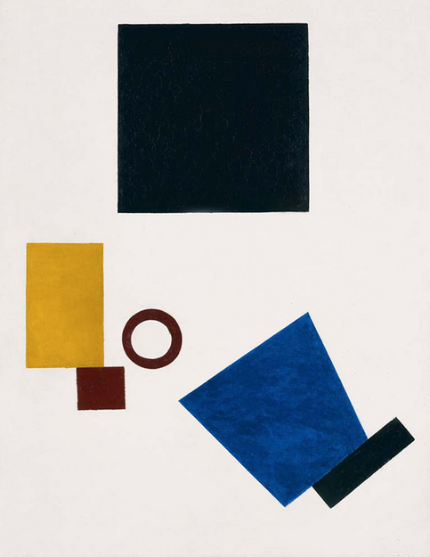

# Major Points:
## Culture
* Need for studio environment - students need to be working together, constantly discussing, trying to fix things, make things, learn new tools and technologies. 
* (Related to above) - Need for culture around visualization, need to show off cool works, get the students to learn who the major players are, what's in or out, and why.
* WE NEED TO BELIEVE THEY CAN DO IT --> the students are already limiting themselves, we CANNOT AFFORD TO LIMIT THEM TOO. 
	* No thriving department I've even been in ever says "our students can't do that." If they can't learn, then it's their failure to work together with us and the other students. That's why we need to start a culture around this thing.
* We need to give them feedback in class and discuss what they've done --> students need to critique eachother's work: "if your work is shit, everyone will know."
	
## Environment
* Need for a change in the classroom structure/environment. No one wants to spend time in the GIS Labs - make it more friendly for hanging out and working there!  

## Technology
* We need to enable students to see how they can turn their ideas into reality. 
* Students should have partners for whom they are responsible in helping
* IMO, teaching data viz / programming concepts in such a short period of time (in this order):
	* R:
		* learning curve is less steep, lots of geolibraries, plotting capabilities are ok, and can even make web apps. 
	
	* Processing: 
		* nice pedagogical tool + nice instant feedback, but syntax is a bit more difficult.
		* One of the standard environments for Data Viz --> the students should atleast know of it's existence. 
	* Python:
		* nice syntax, and overall great language w/ lots of libraries, BUT plotting capabilities are still bad. 
	
	* Javascript/html/css:
		* great for visualization and interaction, but steeper learning curve. 

* Github for assignments and documentation

## Problem Solving
* Students need to work together and solve "puzzles" ALL THE TIME. Lots of little tasks to keep the students' brains engaged.
* Lego block style --> adding more and more at each step and breaking down problems to modular pieces. 
* WE NEED TO SHOW THE LOGIC and have them PRACTICE. 

***

# Exercises:

## Text in --> Visuals out:
Using Processing, draw this image:

* Write down the steps you took to break down the visual
* Did you like this exercise? 
* Do you see how programming can result in images? 
* Did you work in groups? 

 
## "Hello Geo World"
* Using R, let's go from raw data to geo data:
	* Csv with lat/lon coordinates --> shapefile
	* Break down steps, get the students thinking about what it is about the raw data that makes it "geo"
	* Plot them on a screen. 

* we've not made dots on a screen --> woo hoo! --> BUT What about adding a buffer? 
	* now we have a shapefile
	
* reading and writing shapefiles? you can do that too!  

## Wireframing --> Sketching
* make sketches 
 

