<!--### Workshop Topics Covered:
1. Introduction to form and code and visualizations
2. Introduciton to Processing, the environment, and the Community
3. Basic programming fundamentals in Processing
4. How to google search and read documentation-->

# Processing Workshop 

In this workshop we will be introduced to [Processing](https://processing.org) - a programming language and environment developed "to promote literacy within the visual arts and visual literacy within technology". Processing is used across a variety of communities but has had particular success within the art and design community (and data visualization community) for its strength in generating visual and interactive output. We will will use Processing to:

1. Become familiar with the fundamental concepts of programming visual outputs with code.
2. Build our confidence in using code as a material/tool to turn our ideas into something tangible.
3. Learn about the process of deconstructing tasks into modular steps (don't worry if this doesn't mean anything to you yet!).
4. Explore the ways in which code can create accountability for the visualization process. 

We will use the concepts learned in this workshop throughout the rest of the course to learn how to systematically approach data visualization problems and explore other tools and methods of producing visuals with data. 

### What You'll Need
+ Download [Processing](https://processing.org/download/) for your specific operating system. 
+ The confidence, curiosity and enthusiasm to learn and the drive to teach yourself and the patience to help those around you.

***

## index

<!-- START doctoc generated TOC please keep comment here to allow auto update -->
<!-- DON'T EDIT THIS SECTION, INSTEAD RE-RUN doctoc TO UPDATE -->

  - [WOW, we just learned a bunch! Do your brains hurt? Mine too. Let's take some time to let that settle and explore all this new knowledge! ](#wow-we-just-learned-a-bunch-do-your-brains-hurt-mine-too-lets-take-some-time-to-let-that-settle-and-explore-all-this-new-knowledge)
  - [S1. Form & Code](#s1-form-&-code)
  - [S2. Introduction to Processing](#s2-introduction-to-processing)
  - [S3. The Processing Environment](#s3-the-processing-environment)
    - [The Text Editor & Display Window](#the-text-editor-&-display-window)
  - [S4. The Community](#s4-the-community)
- [S5. Getting Started](#s5-getting-started)
  - [S5.1: Make a set of instructions on how to draw a circle, triangle, and square on a piece of paper.](#s51-make-a-set-of-instructions-on-how-to-draw-a-circle-triangle-and-square-on-a-piece-of-paper)
  - [S5.2: Translate your instructions into code](#s52-translate-your-instructions-into-code)
    - [S5.2.1 First: we need a canvas - something to draw on.](#s521-first-we-need-a-canvas---something-to-draw-on)
    - [S5.2.2 Second: select the color of your canvas](#s522-second-select-the-color-of-your-canvas)
    - [S5.2.3 Draw a green circle:](#s523-draw-a-green-circle)
    - [S5.2.4 Draw a red triangle:](#s524-draw-a-red-triangle)
    - [S5.2.5: Draw a blue square:](#s525-draw-a-blue-square)
    - [S5.2.6: Now your code might looks like this:](#s526-now-your-code-might-looks-like-this)
  - [S5.3: Now take 5 minutes to rearange the shapes, change the colors, and show your friends :)](#s53-now-take-5-minutes-to-rearange-the-shapes-change-the-colors-and-show-your-friends-)
    - [S5.3.0: Saving your work](#s530-saving-your-work)
- [S6: Fundamentals](#s6-fundamentals)
  - [S6.1: Structure](#s61-structure)
    - [S6.1.1: comments](#s611-comments)
    - [S6.1.2: Printing to the console:](#s612-printing-to-the-console)
    - [S6.1.3: functions](#s613-functions)
    - [S6.1.4: expressions & statements:](#s614-expressions-&-statements)
  - [S6.2: Shape](#s62-shape)
    - [S6.2.1: coordinates](#s621-coordinates)
    - [S6.2.2: primitives](#s622-primitives)
    - [S6.2.3: properties](#s623-properties)
      - [Basic Color properties](#basic-color-properties)
      - [Basic Stroke Properties](#basic-stroke-properties)
    - [S6.2.4: custom shapes](#s624-custom-shapes)
- [S7: Data & Variables](#s7-data-&-variables)
  - [S7.1: data type: Numeric](#s71-data-type-numeric)
    - [S7.1.1: int](#s711-int)
    - [S7.1.2: float](#s712-float)
  - [S7.2: data type: Boolean](#s72-data-type-boolean)
  - [S7.3: data type: String](#s73-data-type-string)
  - [S7.4: data type: Color](#s74-data-type-color)
- [S8: Math](#s8-math)
  - [S8.1: arithmetic & functions](#s81-arithmetic-&-functions)
    - [S8.1.1: Add](#s811-add)
    - [S8.1.2:subtract](#s812subtract)
    - [S8.1.3:multiply](#s813multiply)
    - [S8.1.4: divide](#s814-divide)
    - [S8.1.5: modulo](#s815-modulo)
    - [S8.1.6: parentheses](#s816-parentheses)
    - [S8.1.7: increment](#s817-increment)
    - [S8.1.8: decrement](#s818-decrement)
    - [s8.1.9: += (add assign), -= (subtract assign), *= (multiply assign), /= (divide assign)](#s819--add-assign---subtract-assign--multiply-assign--divide-assign)
    - [s8.1.10: ceil()](#s8110-ceil)
    - [s8.1.10: floor()](#s8110-floor)
    - [s8.1.11: round()](#s8111-round)
    - [s8.1.12: min(), max()](#s8112-min-max)
- [S9: Control](#s9-control)
  - [S9.1 conditionals & decision making](#s91-conditionals-&-decision-making)
    - [S9.1.1:Relational Expressions](#s911relational-expressions)
  - [S9.2.3:if/else if/ else](#s923ifelse-if-else)
  - [S9.2.4:Logical Operators](#s924logical-operators)
  - [S9.3:repitition](#s93repitition)
  - [S9.3.1:The for loop](#s931the-for-loop)
- [S10: The setup() and draw() functions](#s10-the-setup-and-draw-functions)
  - [S10.1:Random fill ellipse](#s101random-fill-ellipse)
  - [S10.2.1:Enter the Mouse](#s1021enter-the-mouse)
  - [S10.2.1:Enter the Mouse and resetting background](#s1021enter-the-mouse-and-resetting-background)
  - [S10.2.1: Visualizing the speed of the mouse](#s1021-visualizing-the-speed-of-the-mouse)
  - [S10.5:A simple animation](#s105a-simple-animation)
  - [S10.4:A simple animation - a bounce back](#s104a-simple-animation---a-bounce-back)
  - [Let's make our first program ("sketch")](#lets-make-our-first-program-sketch)
- [Recap & Future Directions:](#recap-&-future-directions)
  - [What we learned today](#what-we-learned-today)
- [Future Directions](#future-directions)
  - [Endless learning](#endless-learning)
  - [P5.js](#p5js)
- [Web Searching](#web-searching)
- [References](#references)
- [Resources](#resources)

<!-- END doctoc generated TOC please keep comment here to allow auto update -->

##S1. Form & Code 

<!--

  ()
-->

 Casey Reas,  Path, 2001 (http://reas.com/)

 Casey Reas, A Mathematical Theory of Communication (http://reas.com/)

Ben Fry, Deprocess  (http://benfry.com/deprocess/)

 Christopher Pietsch, Gunnar Friedrich, Pierre La Baume, David Ikuye and Luis Grass, LiquidData(http://www.chrispie.com/labs/liquidata-1151/)

Aaron Koblin's Flight Patterns (http://www.aaronkoblin.com/work/flightpatterns/)

 MIT Senseable City Lab, New York Talk Exchange (http://senseable.mit.edu/nyte/), (https://www.youtube.com/watch?v=YXVM6ivpmyE)

 Delphine Saltet and Olivier Paradeise, Pixtil (http://www.creativeapplications.net/processing/pixtil-weaving-generative-patterns-using-traditional-textile-techniques/)

 MIT Senseable City Lab, Live! Singapore - Rain & Taxis (http://senseable.mit.edu/livesingapore/press.html)

 Benedikt Groß, Metrography (http://benedikt-gross.de/log/2012/02/metrography-london-tube-map-to-large-scale-collective-mental-map/)

  Benedikt Groß, Avena Test Bed (http://benedikt-gross.de/log/2013/06/avena-test-bed_agricultural-printing-and-altered-landscapes/)

 Pedro Cruz, Lisbon's Blood Vessels (http://pmcruz.com/information-visualization/lisbons-blood-vessels)

 P5 Contributor's Confernce  (http://p5js.org/contributors-conference/)

 Dan Shiffman (http://shiffman.net/)

 Moritz Stefaner, Notabilia (http://truth-and-beauty.net/projects/notabilia)

***

## S2. Introduction to Processing

"Processing is for writing software to make images, animations, and interactions. The idea is to write a single line of code, and have a circle show up on the screen. Add a few more lines of code, and the circle follows the mouse. Another line of code, and the circle changes color when the mouse is pressed. We call this sketching with code. You write one line, then add another, then another, and so on. The result is a program created one piece at a time. " - Casey Reas & Ben Fry, *Getting Started With Processing*

"Processing relates software concepts to principles of visual form, motion, and interaction. It integrates a programming language, development environment, and teaching methodology into a unified system. Processing was created to teach fundamentals of computer programming within a visual context, to serve as a software sketchbook, and to be used as a production tool. Students, artists, design professionals, and researchers use it for learning, prototyping, and production" - Casey Reas, *Processing, A Programming Handbook for Visual Designers and Artists*


"Software is a unique medium with unique qualities...
Every programming language is a distinct material...Sketching is necessary for the development of ideas...Programming is not just for engineers..." - Casey Reas, *Processing, A Programming Handbook for Visual Designers and Artists*

In the last X years, Processing has become one of the most used tools for creating visual outputs (among other things). It has a wide usership in many communities, one being the data visualization community because it allows for flexible and custom exploration of data, it is powerful in dealing with large datasets, and has a relatively friendly syntax and large user community. 

***

## S3. The Processing Environment

### The Text Editor & Display Window
The Processing Development Environment (IDE) looks like this:
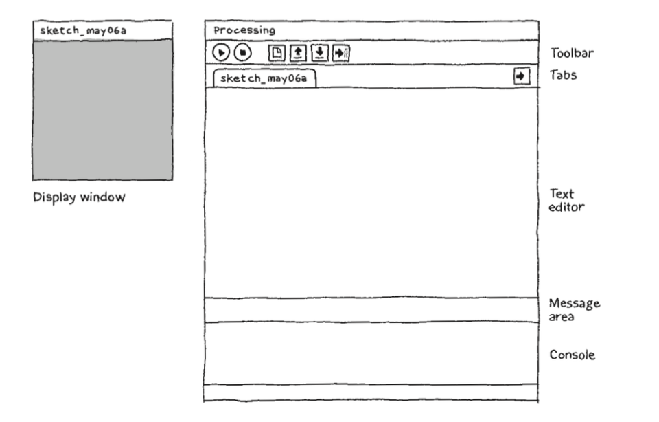

Credits: "Getting started with Processing" - Fry 

PDE Elements:

* Text editor: a nice place to put your code
* Play Button: Run your "sketch"
* Stop Button: Stop your "sketch"
* Message Area: One-line messages are printed here - usually error messages.
* Console: The console will print out feedback - usually text that you instruct it to print out while you are building your sketch. 
* Display Window: "A computer screen is a grid of light elements called pixels. Each pixel has a position within the grid defined by coordinates. " This is where your sketches will be shown. 

***

## S4. The Community
The ethos of Processing is to create an open environment to engage with technology. There's an active community of artists, designers, and scientists from all different domains helping to develop the language & make Processing more accessible. If you continue to work in Processing, you'll definitely find lots of examples and support to help turn your ideas into something tangible. 

***

# S5. Getting Started

## S5.1: Make a set of instructions on how to draw a circle, triangle, and square on a piece of paper.

* grab a piece of paper
* grab a pen
* go the the middle of the page and draw a circle
* go to the 1/3 of the width of the page and draw a triangle
* go the the 2/3 of the width of the page and draw a square

##S5.2: Translate your instructions into code
Let's start with an example and code our first program together! You can literally copy and paste the following code bits into your text editor and run your code each time (press the play button) to see how each step changes the program.

<!--#### Before we do anything: Let's write some pseudocode - enter: *comments*
-->

###S5.2.1 First: we need a canvas - something to draw on. 

We can use Processing's *size()* function to do this. The size() function takes 2 parameters, *width* and *height*. Below we create a canvas that is 700 pixels wide by 500 pixels high: 
 
	// size(width, height);
	size(700, 500);

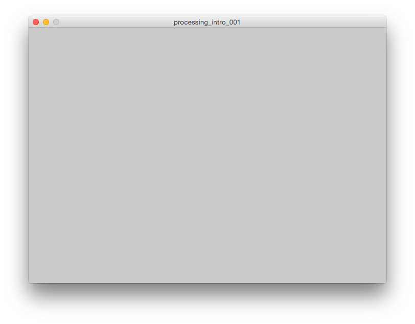

*Notice we have a semi-colon ";" at the end of the size() function. This tells the computer that this is the end of the statement. Make sure to end each statement with a the semi-colon! 

###S5.2.2 Second: select the color of your canvas

We can set the background color with the function *background()*.

**THE FUNCTION**: The *background()* function takes colors in RGB, HSV, and even hex codes. Let's try a few here:
	
	// a black background - RGB
	background(0, 0, 0);

**EXPLAINED**:If we look at the *arguments* in the *background()* function, we notice the numbers, "0, 0, 0". What this means is that each number (0 in this case) controls the red, blue, or green value of the background color:

	//			R		G		B
	background( 0,		0		0 )

So if we wanted to make a white background, we could change the *arguments* in the *background()* function to (255, 255, 255), or if we wanted red, we could use (255, 0, 0). Why don't you try changing the value to see what colors you can come up with!
<!--// a white background - RGB
//background(255, 255, 255);

// a red background - RGB
//background(255, 0, 0);

// a green background - RGB
//background(0, 255, 0);

// a blue background - RGB
//background(0, 0, 255);	

// a black background - hex
//background(#000000);	-->
	

<!--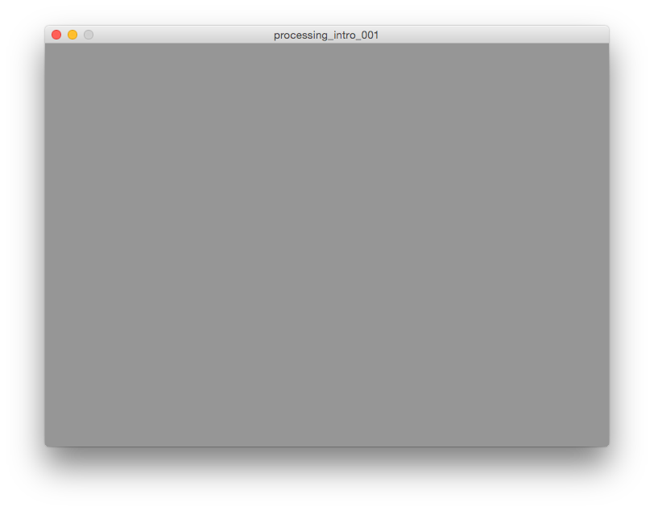	

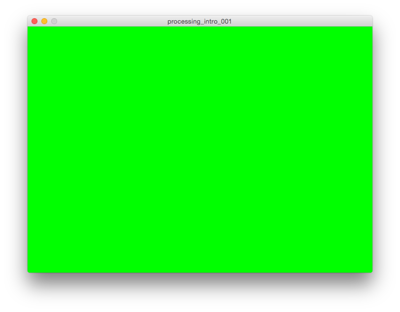-->

*Notice the double forward slashes? these are called **comments** - they are invisible to the computer and do not get evaluated by the computer. These are useful when programming to help you (and others who read your code) keep track of what's happening in your program and allows you to test different functions and statements.

<!--
If you want to try some of the other background color options, try **uncommenting** one of the other background() functions by removing the "//" that come before it while commenting out the *background(150);*
-->
*Notice the ";"? 

###S5.2.3 Draw a green circle:

Let's first draw a circle in the middle of the canvas. 

To draw a circle, we can use the *ellipse()* function. 

The *ellipse()* function takes 4 arguments - the centroid X, centroid Y, the  radius width, and the radius height.

BUT before we can draw the circle, we can choose the *fill()* color. 

Remember we had those RGB color options from the background? Let's try to use the RGB combination for green and see what happens.
	
	// a circle
	//ellipse(x, y, radiusWidth, radiusHeight);
	fill(0, 255, 0);
	ellipse(350, 250, 100, 100);

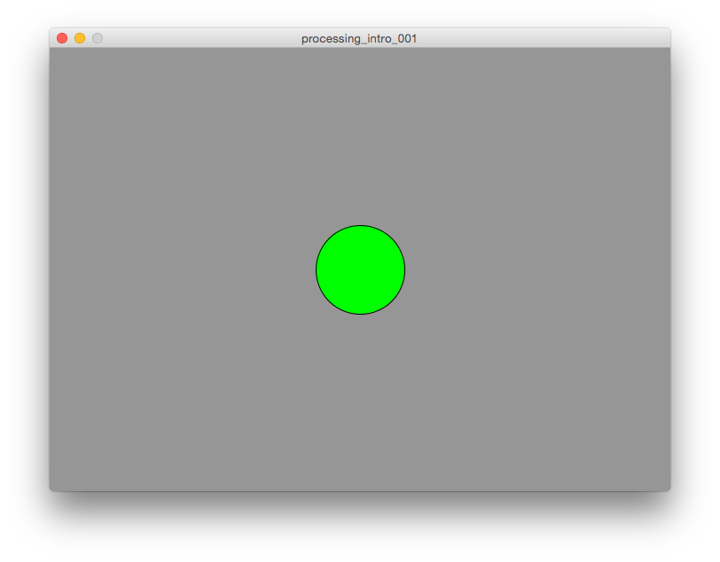

###S5.2.4 Draw a red triangle:
Let's now draw a triangle in the vertical center and third width of the page.

Using the same color principle from the ellipse, let's create a red triangle using the *fill()* function.

	// a triangle
	// triangle(x1, y1, x2, y2, x3, y3);
	fill(255, 0, 0);
	triangle(150, 200, 200, 300, 100, 300);
	
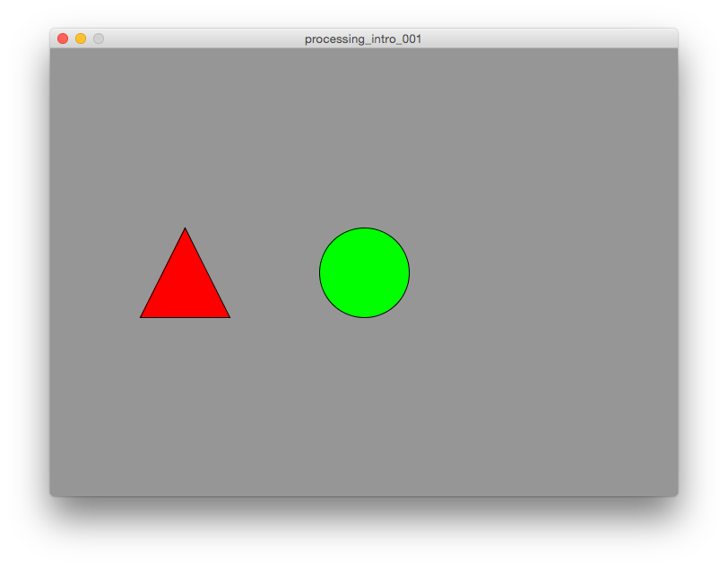
	
###S5.2.5: Draw a blue square:

Let's now draw a square on the other side!

Remember to use the *fill()* function to color the square blue.
	
	// a square
	// rect(x, y, width, height);
	fill(0, 0, 255);
	rect(525, 200, 100, 100);

*Notice, the x & y of the rectangle starts from the top-left corner. We can change this using *rectMode()* and arguements such as "CENTER"... but we can adjust this later ;)

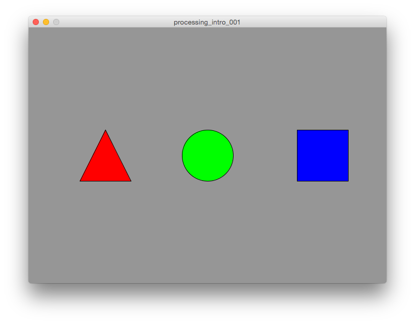

###S5.2.6: Now your code might looks like this:
	size(700, 500);

	// a grey background - RGB
	background(150, 150, 150);
	
	// a circle
	fill(0, 255, 0);
	ellipse(350, 250, 100, 100);
	
	// a triangle
	fill(255, 0, 0);
	triangle(150, 200, 200, 300, 100, 300);
	
	// a rectangle
	fill(0, 0, 255);
	rect(525, 200, 100, 100);

<!--size(700, 500);

// a grey background - RGB
background(150);

// a white background - RGB
//background(255, 255, 255);

// a red background - RGB
//background(255, 0, 0);

// a green background - RGB
//background(0, 255, 0);

// a blue background - RGB
//background(0, 0, 255);  

// a black background - hex
//background(#000000);  

// a circle
fill(0, 255, 0);
ellipse(350, 250, 100, 100);

// a triangle
fill(255, 0, 0);
triangle(150, 200, 200, 300, 100, 300);

// a rectangle
fill(0, 0, 255);
rect(525, 200, 100, 100);
-->

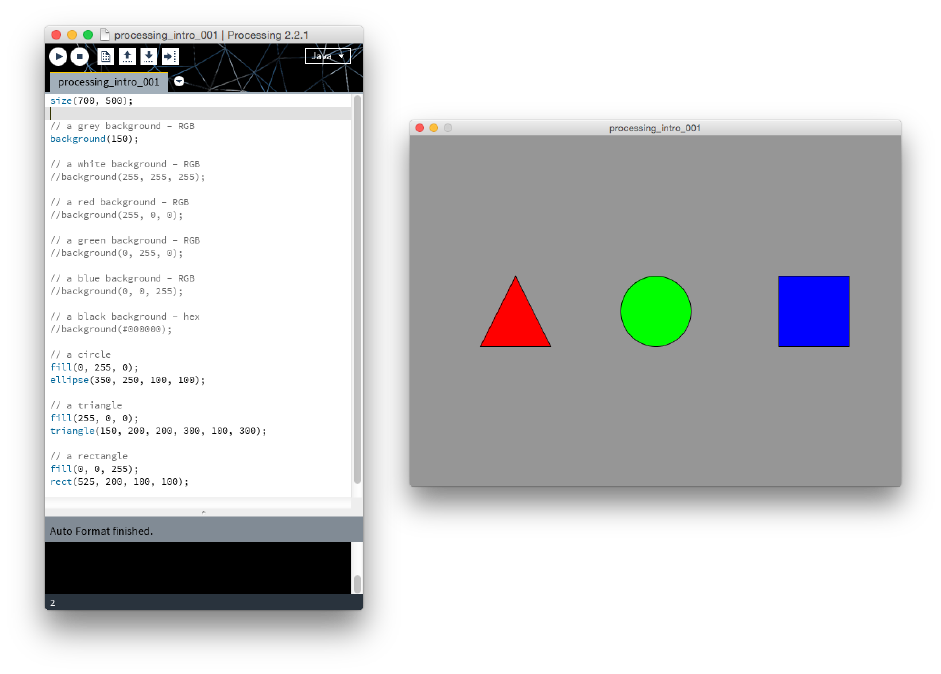

 <em>CONGRATULATIONS, YOU JUST WROTE YOUR FIRST PROGRAM!!! </em> 

##S5.3: Now take 5 minutes to rearange the shapes, change the colors, and show your friends :)

###S5.3.0: Saving your work

When you're programming, saving your work is super important. Let's save our first program. 

* From the PDE, go to "save..."
* Navigate to a folder called "Sketches" (or create one if there isn't already)
* Save your work with a name that doesn't include spaces. The convention is to use "camel case" ,like:
	* "myFirstSketch"

You'll notice when you  save your "sketch" the file type will be added to the end of whatever you called your progam. So if you named your project "myFirstSketch", you will see in your folder "myFirstSketch.pde". The ".pde" is the processing file type (similar to when you see a .csv or .py or .r or .xls, etc etc). 

 <em>How do you feel? Empowered? Confused? Excited? </em> 

 <em>Let's learn more! </em> 

***
#S6: Fundamentals

##S6.1: Structure

***
###S6.1.1: comments

We can use two methods of comments:
	
For **single line comments**: //
	
	// fill(255, 0, 0);
	// ellipse(250, 100, 50, 50);
	
		
OR
	
**Block comments** for multiple lines of code:

	/* 
	fill(255, 0, 0);
	ellipse(250, 100, 50, 50);
	*/

TIP: We can use comments to help us structure our logical steps when writing code. For example:

	// first set the canvas size
	
	// next set the canvas color
	
	// next draw a circle in the center of the canvas. Since the canvas is 700 pixels wide and 500 pixels tall, the center must be at (350, 250). 
	
	// next draw a triangle about 1/3 the width of the canvas
	
	// ... 

<!--* #### statement terminator:

	The semi-colon ";" is used to define the end of a statement. In the exercise above, -->
***
### S6.1.2: Printing to the console:
The most basic way to get feedback from a computer is by "printing to the console." We can do this by using the *print()* or *println()* functions. The difference between *print()* and *println()* is that *print()* does not start a new line break after each function call. If this seems like a bunch of hogwash, try out the examples below :)

*print()*

	print("Hello World");
	print("My name is Joey");
	print("It is raining outside");
	
*println()*

	println("Hello World");
	println("My name is Joey");
	println("It is raining outside");
	
***
### S6.1.3: functions

**Functions** allow you to draw shapes, set colors, calculate numbers, and to execute many other types of actions. A function’s name is usually a lowercase word followed by parentheses. The comma-separated elements between the parentheses are called **parameters**, and they affect the way the function works. Some functions have no parameters and others have many. This program demonstrates the size() and background() functions.
cont.


	// The size function has two parameters. The first sets the width of the display window and the second sets the height
	size(200, 200);

	
	// This version of the background function has one parameter.
	// It sets the gray value for the background of the display window in the range of 0 (black) to 255 (white)
	background(102);

***
### S6.1.4: expressions & statements:

Using an analogy to human languages, a software expression is like a phrase. Software expressions are often combinations of operators such as +, *, and / that operate on the values to their left and right. A software expression can be as basic as a single number or can be a long combination of elements. An expression always has a value, determined by evaluating its contents.

	// expression		// value
	10 < 50 			true
	
	// expression		// value
	5*3					15
	

A statement - composed of a set of expressions - is like a sentence that gets translated into machine readable code that instructs the computer to do something. For example we see each of these statements (below) tell the computer to do a particular task. 

	size(200, 200); 	// Runs the size() function to set the canvas size
	int x; 				// Declares a new variable x as an integer type
	x = 102; 			// Assigns the value 102 to the variable x
	background(x); 		// Runs the background() function

				
<!--		
* #### setup & draw

	The *setup()* and *draw()* functions of Processing are the bread and butter of sketching in the Processing language. 
	
-->

***
## S6.2: Shape

In the above example, we made our first program consisting of a circle, triangle, and square. Let's dive into how we can draw shapes with Processing.

***
### S6.2.1: coordinates

The coordinate space of a Processing canvas is set using the *size()* function. The parameters for *width* and *height* sets the number of pixels that will be in the *x-coordinate* space and *y-coordinate* space. 

The Processing canvas starts at (0,0) at the top-left corner of the canvas. 

Credits: "A Programming Handbook for Visual Artists and Designers" - Reas & Fry

*for your reference: Processing also comes with a number of other renderers including a 3D renderer, but we won't get into this now - just something to think about!

***
### S6.2.2: primitives

Processing's primitive shapes are the bread and butter of making visual output with code. As we saw in our first program in which we made a circle, triangle, and square with one function, there are other primitive shapes that we can use. These primitives are listed below:

***
**point(x,y)**

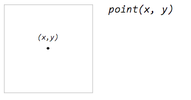

Experiment: draw 5 points in a row on your screen

***
**line(x1, y1, x2, y2)**

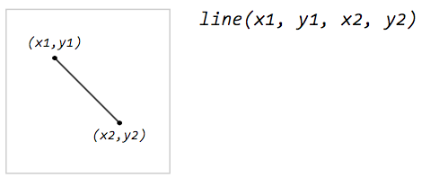

Experiment: draw 3 "x's" on your screen using lines
***
**triangle(x1, y1, x2, y2, x3, y3)**

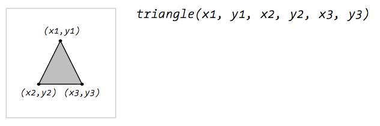

Experiment: draw 3 triangles if different sizes slightly overlapping eachother
***
**quad(x1, y1, x2, y2, x3, y3, x4, y4)**

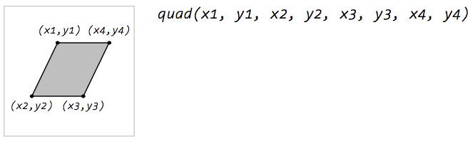

Experiment: draw 1 funky quadrilateral
***
**rect(x, y, width, height)**

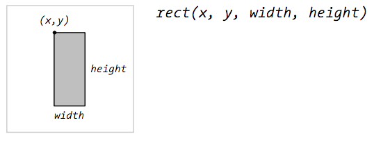

Experiment: draw 2 rectangles with exactly the same arguements - use the rectMode(CENTER) function for 1 of the rectangles and see what it does.
***
**ellipse(x, y, width, height)**

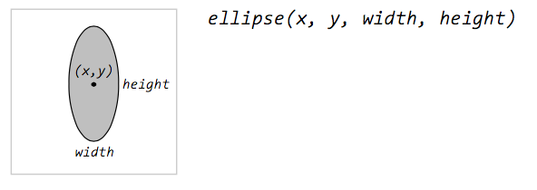

Experiment: draw a "bullseye" target with 6 ellipses. Play will fill colors to change the color of each ellipse.
***
**bezier(x1, y1, cx1, cy1, cx2, cy2, x2, y2)**

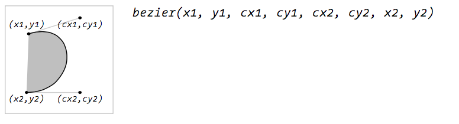

Experiment: draw 1 bezier curve to see how it works.
***
### S6.2.3: properties

In Processing we can change the properties of the shapes to affect their fill color, stroke color, and drawing mode. Let's go over a few of them here:

#### Basic Color properties
*If we use RGB color space*:

	* value1 = red 			(between 0 - 255)
	* value2 = green 		(between 0 - 255)
	* value3 = blue 		(between 0 - 255)
	* alpha = transparency 	(between 0 - 100)

*Processing comes with a handy Color tool to select colors*

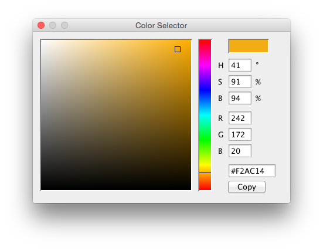

*NOTE: if you want to save a color to a variable, you must use the *color* type:
	
	color pink = color(255, 8, 152);
	background(pink);

***
**fill()**

	fill(value1, value2, value3)
   	fill(value1, value2, value3, alpha)

***
**noFill()**

Use the *noFill()* function if you don't want a fill color

	size(700, 500);
	
	// with fill
	fill(242, 172, 20);
	ellipse(width*0.25, height * 0.5, 150, 150);
	
	// no fill
	noFill();
	ellipse(width*0.75, height * 0.5, 150, 150);

Experiment: make your own example using noFill() with another set of shapes like a triangle and rectangle.

***
#### Basic Stroke Properties
**stroke()**

	stroke(value1, value2, value3)
   	stroke(value1, value2, value3, alpha)

***
**noStroke()**

Use the *noStroke()* function if you don't want a stroke color
	
	size(700, 500);
	
	// no stroke
	noStroke();
	fill(242, 172, 20);
	ellipse(width*0.25, height * 0.5, 150, 150);
	
	// black stroke
	stroke(0);
	fill(242, 172, 20);
	ellipse(width*0.75, height * 0.5, 150, 150);

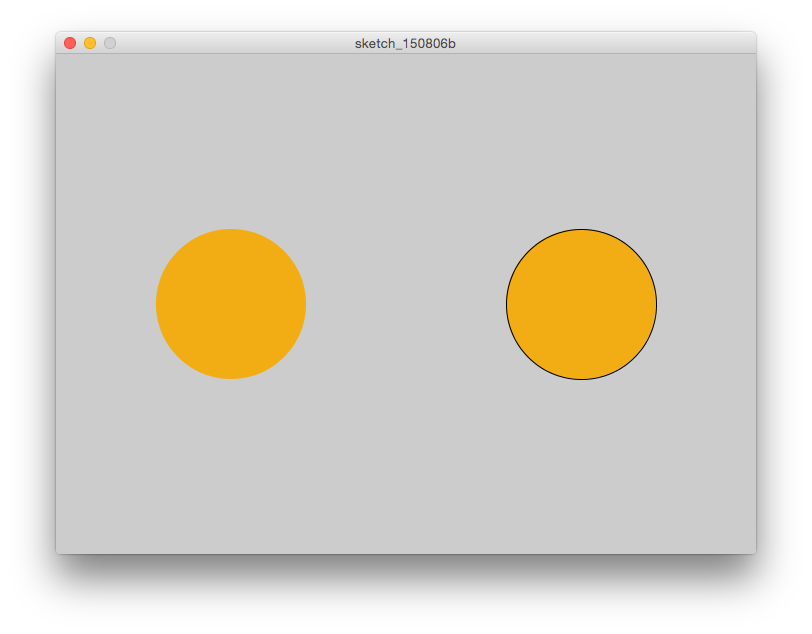

Experiment: make your own example using stroke() and noStroke() with another set of shapes like a triangle and rectangle.

***
**strokeWeight()**

You can use the *strokeWeight()* function to change the width of the stroke. 

	size(700, 500);

	strokeWeight(1);
	line(width*0.25, height * 0.25, width*0.75, height * 0.25); 
	
	strokeWeight(3);
	line(width*0.25, height * 0.35, width*0.75, height * 0.35); 
	
	strokeWeight(5);
	line(width*0.25, height * 0.45, width*0.75, height * 0.45); 
	
	strokeWeight(7);
	line(width*0.25, height * 0.55, width*0.75, height * 0.55);
	
	strokeWeight(9);
	line(width*0.25, height * 0.65, width*0.75, height * 0.65);
	
	strokeWeight(10);
	line(width*0.25, height * 0.75, width*0.75, height * 0.75);

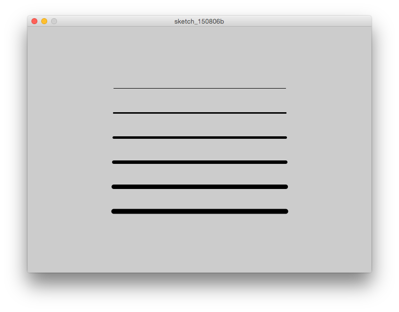

Experiment: make your own example using strokeWeight() AND noFill() with a set of slightly overlapping rectangles.

<!--***
**smooth()**

Use the *smooth* function to create smooth strokes.

	size(700, 500);
	
	// not smooth line
	stroke(0);
	strokeWeight(3);
	fill(242, 172, 20);
	ellipse(width*0.25, height * 0.5, 150, 150);
	
	// smooth line
	smooth();
	stroke(0);
	strokeWeight(3);
	noFill();
	ellipse(width*0.75, height * 0.5, 150, 150);

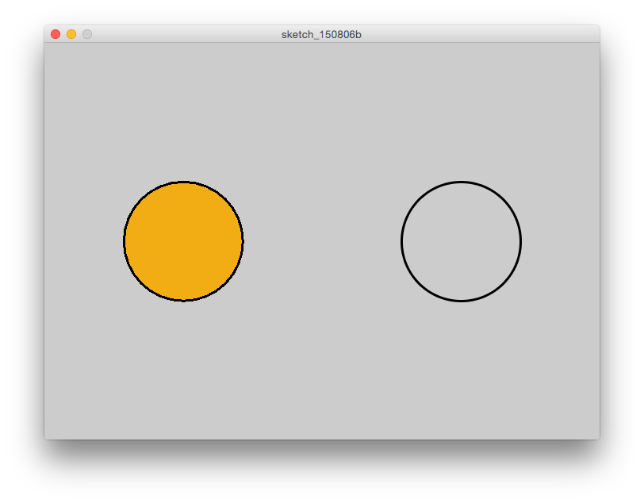

You're probably wondering, "why wouldn't we want smooth lines all time?". Anti-aliasing is awesome, but it does take computational power. While it is not much computational effort to do this for a dozen or couple hundred shapes or even a thousand shapes, what about tens or hundreds of thousands of shapes?
-->
***

### S6.2.4: custom shapes

In Processing we can create our own shapes from a series of vertices. We can do by sandwiching a series of *vertex(x,y)* functions in between the *beginShape()* and *endShape()* functions.

For example - let's make a funny fish:

	size(700, 500);
	strokeWeight(4);
	
	// right eye
	fill(255);
	ellipse(width*0.6, height*0.2, 50, 100);
	fill(0);
	ellipse(width*0.6, height*0.15, 25, 50);
	
	// body
	fill(255);
	stroke(0);
	beginShape();
	vertex(width*0.25, height*0.75);
	vertex(width*0.35, height*0.15);
	vertex(width*0.45, height*0.25);
	vertex(width*0.65, height*0.25);
	vertex(width*0.55, height*0.85);
	endShape(CLOSE);
	
	// left eye
	fill(255);
	ellipse(width*0.5, height*0.35, 50, 100);
	fill(0);
	ellipse(width*0.5, height*0.3, 25, 50);

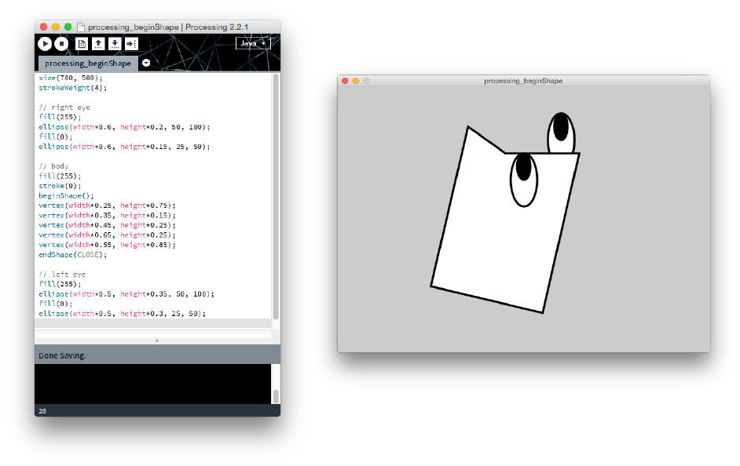

***
There are a number of shape mode parameters that can be passed into the *beginShape()* function in order to have more control over the custom shapes being produced. These include:

**beginShape(POINTS)**

	// Draws a point at each vertex 
	beginShape(POINTS);
	vertex(30, 20);
	vertex(85, 20);
	vertex(85, 75);
	vertex(30, 75);
	endShape();

**beginShape(LINES)**

	// Draws a line between each pair of vertices 7-08 
	beginShape(LINES);
	vertex(30, 20);
	vertex(85, 20);
       vertex(85, 75);
       vertex(30, 75);
       endShape();

**beginShape(TRIANGLES)**

	// Connects each grouping of three vertices as a triangle 7-09 
	beginShape(TRIANGLES);
	vertex(75, 30);
	vertex(10, 20);
	vertex(75, 50);
	vertex(20, 60);
	vertex(90, 70);
	vertex(35, 85);
	endShape();

**beginShape(TRIANGLE_STRIP)**

	// Starting with the third vertex, connects each subsequent vertex to the previous two 
	beginShape(TRIANGLE_STRIP);
	vertex(75, 30);
	vertex(10, 20);
	vertex(75, 50);
	vertex(20, 60);
	vertex(90, 70);
	vertex(35, 85);
	endShape();
**beginShape(TRIANGLE_FAN)**
	
	beginShape(TRIANGLE_FAN);
	vertex(10, 20);
	vertex(75, 30);
	vertex(75, 50);
    vertex(90, 70);
    vertex(10, 20);
    endShape();

**beginShape(QUADS)**
	
	beginShape(QUADS);
	vertex(30, 25);
	vertex(85, 30);
	vertex(85, 50);
	vertex(30, 45);
	vertex(30, 60);
	vertex(85, 65);
	vertex(85, 85);
	vertex(30, 80);
	endShape();

**beginShape(QUAD_STRIP)**

	beginShape(QUAD_STRIP);
	vertex(30, 25);
	vertex(85, 30);
	vertex(30, 45);
	vertex(85, 50);
	vertex(30, 60);
	vertex(85, 65);
	vertex(30, 80);
	vertex(85, 85);
	endShape();

All of these shape modes are super exciting and interesting, but we won't go into much more detail here. For more info, check out the Processing Documentation and/or the "Programming Handbook for Visual Artists and Designers" by Reas & Fry.

# S7: Data & Variables

What is data? Data could be anything from the time of day, the location of a bus stop, the color of your hair, and even the location of your mouse on the screen and the keys you pressed to login to your email. In general, data often consists of measurements of physical characteristics whether it be a digital photo of your dog or the precipitation in Vancouver. 

Processing can store, modify, and manipulate many different kinds of data, including numbers, letters, words, colors, images, fonts, and boolean values (true, false).

One of the key features of programming is the ability to store values and/or data to variables. Below are the main data types in Processing - and programming in general - and examples of how to store them to a variable in Processing. NOTE: Processing (the java version) is strongly typed and thus we must declare what the data type will be when assigning data to a variable. If this sounds crazy, have a look at the examples below :)

## S7.1: data type: Numeric

###S7.1.1: int

Integers are whole numbers such as 12, -120, 8, and 934. 

Processing represents integer data with the "int" data type.

	// we declare that joey's nerd level is an int equal to 10
	int joeyNerdScore = 10;
	
	// we declare that the number of days in a year is equal to 365
	int daysInYear = 365;

we can also write the above as:
	
	// first declare that joey's nerd score will be a variable
	int joeyNerdScore; 
	// then assign joeyNerdScore is equal to 10
	joeyNerdScore = 10;
	
	// first declare that there will be a variable called daysInYear that is an integer
	int daysInYear; 
	// then assign daysInYear equal to 365
	daysInYear = 365;

Why would we declare the variable first then assign it later? This becomes important when we start to get into a thing called "variable scope" and learn more about local and global variables in a program. For now, choose whichever one makes most sense to you. 
	
***
###S7.1.2: float

Floating-point numbers have a decimal point for creating fractions of whole numbers such as 12.8, -120.75, 8.125, and 934.82736. 

Processing represents floating-point data with the "float" data type

	// we assign joey's enthusiasm for teaching equal to 100
	float joeyEnthusiasm = 100.0;
	
	// We assign the class's enthusiasm for learning equal to 2 times that of joey's
	float classEnthusiasm = joeyEnthusiasm * 2.0;
	
Whoa! Did we just take joey's enthusiasm (joeyEnthusiasm) --> multiply it by 2.0 --> then assign the result to the class's enthusiasm (classEnthusiasm)? We sure did! This is just an example of how Processing can:

* store data in a variable -->
* do something with that variable -->
* store the result into another variable

As in the example above we can also declare our variables first then assign the values to the variable later like this:

	// we first declare the variables we're going to use
	float joeyEnthusiasm; 
	float classEnthusiasm;
	
	// then we assign the values to the variables - pretty cool! 
	joeyEnthusiasm = 100.0;
	classEnthusiasm = joeyEnthusiasm * 2.0;

	
<!--
This may not seem that exciting right now, but this is the fundamental concept underlying how we, for example:
	
	* do geoprocessing: make buffers, perform intersections and spatial joins, make raster calculations
	* make visualizations with graphs
-->
***
##S7.2: data type: Boolean

**boolean**
The simplest data element in Processing is a boolean variable. Variables of this type can have only one of two values—true or false. The name boolean refers to the mathematician George Boole (b. 1815), the inventor of Boolean algebra—the foundation for how digital computers work. A boolean variable is often used to make decisions about which lines of code are run and which are ignored.

	// it is false that it is July
	boolean july = false;
	
	// it is true that we're in vancovuer
	boolean vancouver = true;
	
	

These data types are super exciting and great, but for now, just know that they exist... we can revist them later :)
***
##S7.3: data type: String

	**String**

***
##S7.4: data type: Color

	**color**

***
#S8: Math
Math can be an important aspect of programming, but it’s not necessary to be good at math to understand or enjoy programming. 

##S8.1: arithmetic & functions

Here's a list of the main arithmetic functions in Processing. There are others including functions for making exponents, doing square roots, making log transformations, etc - for a full list check the Processing Documentation. 

	+ (add)
	- (subtract) 
	* (multiply)
	/ (divide)
	% (modulus)
    () (parentheses)
    ++ (increment)
    -- (decrement)
    += (add assign)
    -= (subtract assign)
    *= (multiply assign)
    /= (divide assign)
    - (negation)
    ceil()
    floor()
    round()
    min()
    max()

***
###S8.1.1: Add

	 int x;
	 int y;
	 int z;
	 
	 x = 10;
	 y = 5;
	 z = x + y;
	 
	 println(z);  // z will equal 15
	 
	 // let's take z and set the background color
	 background(z);
	 
	 // then create an ellipse and set the fill(z, z+100, z+20)
	 fill(z, z+100, z+20);
	 ellipse(width/2, height/2, 50, 50);

Experiment: Using addition and variable declarations, come up with your own exmple of how you might use a the combination to *parameterize your drawing*
***
###S8.1.2:subtract

	int x;
	int y;
	int z;
	 
	x = 10;
	y = 5;
	z = x - y;
	 
	println(z);  // z will equal 5
	
	// let's make a yellow ellipse with a strokeWeight(z)
	strokeWeight(z);
	fill(#FFF700);
	ellipse(width/2, height/2, 50, 50);

Experiment: Change the numbers in the sketch to see how changing the value of the varibles affects your shapes.
***
###S8.1.3:multiply
	int x;
	int y;
	int z;
	 
	x = 10;
	y = 5;
	z = x * y;
	 
	println(z);  // z will equal 50
	
	// let's make a rectangle that's z pixels wide and z*2 pixels high
	size(400, 400);
	rect(width/2, height/2, z, z*2);

Experiment: Change the numbers in the sketch to see how changing the value of the varibles affects your shapes.

***
###S8.1.4: divide

	int x;
	int y;
	int z;
	 
	x = 10;
	y = 5;
	z = x / y;
	 
	println(z);  // z will equal 2
	
	// let's make 3 ellipses adjusting their width and height by the z value, in this case just dividing by 2
	size(400, 400);
	
	fill(z+240, z+15, z*4);
	ellipse(width/2, height/2, 100/z, 100/z);
	
	fill(z, z*60, z+60);
	ellipse(width/2, height*0.25, 50/z, 50/z);
	
	fill(z, z*35, z+200);
	ellipse(width/2, height*0.75, 50/z, 50/z);

***	
###S8.1.5: modulo

The modulo returns the remainder of the division between two numbers
	
	int x; 
	int y;
	int z;
	int j;
	int i;
	
	x = 10;
	y = 5;
	j = 3;
	
	z = x % y;
	i = x % j;
	
	println(z); // z will equal 0 since the remainder of 10/5 is 0
	println(i); // i will return 1 since the remainder of 10/3 is 1
	
	// Here's an if/else statement - we're going to learn about these in section: Control!
	if (z == 1){
		fill(#00F9FF); // if z == 1, then color the ellipse turqoise
	} else {
		fill(#FE00FF); // if z does not equal 1, then color the ellipse purple
	}
	
	ellipse(width/2, height/2, 50, 50); // we'll see a purple ellipse! 

***
###S8.1.6: parentheses

The parentheses can be used to set up your mathematical order of operations  (remember PEMDAS?). Be sure to keep the order of operations in mind when writing your statements.

	int x = 3 + 4 * 5; // Assign 23 to x 
	int y = (3 + 4) * 5; // Assign 35 to y
	
	println(x);
	println(y);

***
###S8.1.7: increment

The increment is a shortcut for adding 1 value to an existing variable.

	// incrementing the long way;
	int x = 0;
	x = x + 1;
	println(x); // x will print as 1;

	// incrementing the short way:
	int y = 0;
	y++;
	println(y); // y will print as 1;

Experiment: use the increment to change the stroke size of 3 lines

***
###S8.1.8: decrement

	// decrementing the long way;
	int x = 10;
	x = x - 1;
	println(x); // x will print as 9;

	// incrementing the short way:
	int y = 10;
	y--;
	println(y); // y will print as 9;

Experiment: use the increment to change the stroke size of 3 lines

***
###s8.1.9: += (add assign), -= (subtract assign), *= (multiply assign), /= (divide assign)
The add assign, subtract assign, multiply assign, and divide assign allow you to add, subtract, multiply, or divide a variable by a specified value:

	// add assign
	float a = 10.0;
	a += 10;
	println(a); 	// a will print as 20.0;
	
	// subtract assign
	float b = 35.6;
	b -= 0.6;
	println(b);  	// b will print as 35.0
	
	// multiply assign
	int c = 100;
	c *= 3;
	println(c);		// c will print as 300
	
	// divide assign
	int d = 36;
	d /= 4;
	println(d); 	// d will print as 8

***
###s8.1.10: ceil()
  
  The ceil() function rounds whatever parameter **up** to the nearest whole number
  
		// round 32.4 up to 33.0
		float y = ceil(32.4);
		println(y); 
		
		// round 67.7 up to 68
		float x = ceil(67.7);
		println(x);
  		
  
###s8.1.10: floor()
  
  The floor() function rounds whatever parameter **down** to the nearest whole number
  	
  	
  		// round 32.4 down to 32.0
		float y = floor(32.4);
		println(y); 
		
		// round 67.7 up to 67.0
		float x = floor(67.7);
		println(x);
  		
  
###s8.1.11: round()
  
  The round() function returns the closest value.
  
  		// round 32.4 to 32.0
		float y = round(32.4);
		println(y); 
		
		// round 67.7 up to 68.0
		float x = round(67.7);
		println(x);
  
###s8.1.12: min(), max()
  
  The min() function returns the minimum value from a sequence of at least 2, but maximum 3 parameter. You can also apply the min() function on an array to return the minimum value in an array of numbers.
  
  		int u = min(5, 9); // Assign 5 to u
  		
	int v = min(-4, -12, -9); // Assign -12 to v 
	
	float w = min(12.3, 230.24); // Assign 12.3 to w 


The max() function returns the maximum value from a sequence of at least 2, but maximum 3 parameters. You can also apply the max() function on an array to return the maximum value in an array of numbers.
	
	int x = max(5, 9); // Assign 9 to x
	
	int y = max(-4, -12, -9); // Assign -4 to y 

	float z = max(12.3, 230.24); // Assign 230.24 to z

***
#S9: Control

The programs we’ve seen so far run each line of code in sequence. They run the first line, then the second, then the third, etc. The program stops when the last line is run. It’s often beneficial to change this order—sometimes skipping lines or repeating lines many times to perform a repetitive action. Although the lines of code that comprise a program are always positioned in an order from top to bottom on the page, this doesn’t necessarily define the order in which each line is run. This order is called the flow of the program. Flow can be changed by adding elements of code called control structures.

##S9.1 conditionals & decision making

###S9.1.1:Relational Expressions
 A relational expression is made up of two values that are compared with a relational operator. In Processing, two values can be compared with relational operators as follows:
		
		Expression			Evaluation

		3> 5 				false

		3< 5 				true

		5< 3 				false
		
		5> 3				true

In Processing, we have these relational operators at our fingertips in order to evaluate truthy or falsy values:
	
		Operator 			Meaning
		> 					greater than

		< 					less than

		>= 					greater than or equal to <= less than or equal to

		== 					equivalent to
		
		!= 					not equivalent to

	

A few examples of the above:

**>**

	// 3 is greater than 5 is FALSE
	println(3 > 5); // Prints "false"

**<**

	// 3 is less than 5 is TRUE
	println(3 < 5); // Prints "true"

**<=**

	// 3 is less than or equal to 5 is TRUE
	println(3 <= 5); // Prints "true"

**>=**

	// 3 is greater than or equal to 5 is FALSE
	println(3 >= 5); // Prints "false"

**==**

	// 3 is equal 5 is FALSE
	println(3 == 5); // Prints "false"

**!=**
	// 3 does not equal 5 is TRUE
	println(3 != 5); // Prints "true"


***

##S9.2: Conditionals: if/else/else if statements 

Conditionals allow a program to make decisions about which lines of code run and which do not. They let actions take place only when a specific condition is met. Conditionals allow a program to behave differently depending on the values of their variables.

if/else statements are ways to control the behavior of your program. This allows us to make decisions about what happens in our code. if/else statements might allow us to filter out data, change the size of an ellipse or rectangle depending on the value of a variable, or react to a mouse or key input (oooh fancy!). 

##S9.2.1: A simple if statement

Below we have a basic structure of an if statement. It basically says: "if a condition is met, execute the statements within the brackets."

	// psuedo code - this wont run in Processing
 	if (test) {
     		statements
	}

Let's try an example:

	// if x is greater than 20, print "hello", and draw a triangle

	int x = 20;

	if (x > 20){
		println("hello");
		triangle(width/2, height*0.25, width*0.75, height*0.75, width*0.25, height*0.75);
	}

But wait! nothing happened! we don't see a hello or a triangle. Well, well, well, turns out the computer understood our directions. Because x is not greater than 20, our statements within the if statement were not run.

Let's **change x to 21** and see what happens...

	// if x is greater than 20, print "hello", and draw a triangle
	
	int x = 21;
	
	if (x > 20){
		println("hello");
		triangle(width/2, height*0.25, width*0.75, height*0.75, width*0.25, height*0.75);
	}


BOOM! Our if statement worked! Pretty sweet. 

Experiment: Write your own example of an "if statement".

* Add a variable or two and use some of the arithmetic operators
* change the condition to be met 
* change what statements should occur if the conditional is met.



**But surely we can add more control than this... the answer is yes!**

***

##S9.2.2:A simple if/else statement

The if/else combo allows you to say "if a condition is met, then execute the statements within the brackets of the "if" statement, HOWEVER if those conditions are NOT met, then run the statements within the brackets of the "else" statement."

	// psuedo code - this wont run in Processing
 	if (test) {
     		statements
	} else {
		statements
	}

let's take the example above and add an "else" statement:
	
	// if x is greater than 20, print "I'm a triangle", and draw an orange triangle, HOWEVER if it is less than 20, then draw a purple ellipse and print "i'm an ellipse".

	int x = 20;

	noStroke();

	if (x > 20){
		println("I'm a triangle");
		fill(#FFA600);
		triangle(width/2, height*0.25, width*0.75, height*0.75, width*0.25, height*0.75);
	} else{
		println("I'm an ellipse");
		fill(#9400FF);
		ellipse(width/2, height/2, 50, 50);
	}


Yeah! now we see our purple ellipse since x is not greater than 20.

Let's change the x value to 21 and see what happens:

	// if x is greater than 20, print "I'm a triangle", and draw an orange triangle, HOWEVER if it is less than 20, then draw a purple ellipse and print "i'm an ellipse".

	int x = 21;

	noStroke();

	if (x > 20){
		println("I'm a triangle");
		fill(#FFA600);
		triangle(width/2, height*0.25, width*0.75, height*0.75, width*0.25, height*0.75);
	} else{
		println("I'm an ellipse");
		fill(#9400FF);
		ellipse(width/2, height/2, 50, 50);
	}

Boom! An orange triangle. We're totally telling the computer who's boss!

Experiment: Write your own if/else statement, and use it to control the size of an ellipse that is drawn to your canvas.

***

##S9.2.3:if/else if/ else

We've now made an if statement, and if/else statement, and now we want to add 1 more layer of control to our decision making. Here we introduce the "else if" conditional. The else if statement allows us to say "if a condition is met, then execute the statements within the brackets of the if statement, HOWEVER if those conditions are NOT met, then evaluate whether or not the condition is met for the "else if" statement. If the condition is met in the "else if statement", then run the statements within those brackets, if not, then check if the conditions are met in the next else if statement , BUT if those conditions are not met, then go on to the next else if statement, and so on an so forth. And if none of those are met, then run the else statement."

	// psuedo code - this wont run in Processing
 	if (test) {
     		statements
	} else if (test) {
		statements
	} else if {
		statements
	} 

	... (as many else if statements as you'd like)...

	else{
		statements
	}

Let's tweek the example from above. In this case, if x is equal to 20, still draw the triangle, but make it turquoise:

	// if x is greater than 20, print "I'm a triangle", and draw an orange triangle, BUT if x is equal to 20, then draw a turqoise triangle,  HOWEVER if x is less than 20, then draw a purple ellipse and print "i'm an ellipse".

	int x = 20;

	noStroke();

	if (x > 20){
		println("I'm an orange triangle");
		fill(#FFA600);
		triangle(width/2, height*0.25, width*0.75, height*0.75, width*0.25, height*0.75);
	} else if (x == 20) {
		println("I'm a turquise triangle");
		fill(#00FFCA);
		ellipse(width/2, height/2, 50, 50);
	} else{
		println("I'm an purple ellipse");
		fill(#9400FF);
		ellipse(width/2, height/2, 50, 50);
	}

Experiment: Come up with your own sequence of if/else if/else statements
	
##S9.2.4:Logical Operators 

We can have multiple "tests" conditions in an if or else if statement. Using the logical operators to combine test conditions in an if or else if statement makes it possible to do this.

	Operator 			Meaning
	
	&& 					AND 

	|| 					OR 

	! 					NOT 


	Expression			Evaluation

	true && true		true
	true && false		false
	false && false		false
	true || true		true
	true || false		true
	false || false		false
	!true				false
	!false				true

	

Let's look at one example:

	int a = 10;
	int b = 20;

	
	// The expression "a > 5" must be true OR "b < 30"
	// must be true. Because they are both true, the code // in the block will run.
	if ((a > 5) || (b < 30)) {
	  line(20, 50, 80, 50);
	}
	// The expression "a > 15" is false, but "b < 30"
	// is true. Because the OR operator requires only one part // to be true in the entire expression, the code in the
	// block will run.
	if ((a > 15) || (b < 30)) {
	  ellipse(50, 50, 36, 36);
	}
And 1 example using boolean values:

	
	boolean b = true;
	
	// because b is true, the line will draw
	if (b == true){
		line(20, 50, 80 ,50);
	}
	
	if (!b == true){
		ellipse(50, 50, 36, 36);
	}
##S9.3:repitition
	
	Computers are excellent at executing repetitive tasks accurately and quickly. Modern computers are also logic machines. Building on the work of the logicians Leibniz and Boole, modern computers use logical operations such as AND, OR, and NOT to determine which lines of code are run and which are not.
	
##S9.3.1:The for loop
	
The for loop is probably the coolest thing since ever. At the most basic level for loops allow your to repeat a statement or statements over and over again until a condition is met. 

Why are for loops so awesome? Let's look at an example of how a loop can be used to take a program which takes 14 lines of code to make 14 lines...

	// original hard-coded program
	size(200, 200);
	line(20, 20, 20, 180);
	line(30, 20, 30, 180);
	line(40, 20, 40, 180);
	line(50, 20, 50, 180);
	line(60, 20, 60, 180);
	line(70, 20, 70, 180);
	line(80, 20, 80, 180);
	line(90, 20, 90, 180);
	line(100, 20, 100, 180);
	line(110, 20, 110, 180);
	line(120, 20, 120, 180);
	line(130, 20, 130, 180);
	line(140, 20, 140, 180);


... and make the program 4 lines of code:

	size(200, 200);
	for (int i = 20; i < 150; i += 10) {
	  line(i, 20, i, 180);
	}

***
The general structure if described in the image below. 
	
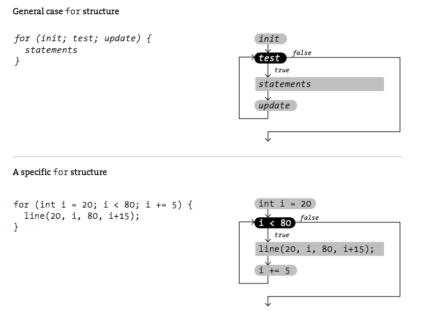
Credits: "A Programming Handbook for Visual Artists and Designers" - Reas & Fry

Let's look closer at the specific "for" structure:
	
	for (int i = 20; i < 80; i += 5) {
			line(20, i, 80, i+15);
	}
 
If you were to read this out loud it would sound like: "for the integer i equals 20, as long as i is less than 80, increment i by 5, drawing a line each time with new y coordinates based on i."

***

Let's get a little crazy and make a nested loop. A nested loop? You can do that?! Sure!

	size(400, 400);
	noStroke();
	
	for (int i = 20; i < width - 20; i += 15) {
	  for (int j = 20; j < height - 20; j += 15) {
	  		fill(random(255), random(255), random(255));
	  		ellipse(i, j, 10, 10);
		}
	}


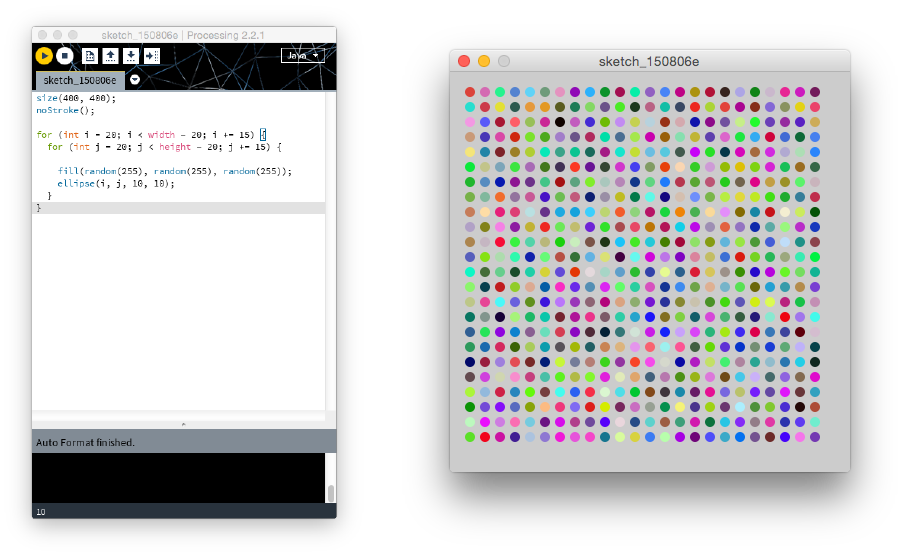

How does a nested loop work? First, the outer loop starts. Then the inner loop runs until the condition is met at which point the outer loop increments, repeating the inner loop again until the condition is met at whihc point the outer loop increments, and over and over until the outer loop condition is met. This means that columns of ellipses are drawn from left to right with each complete loop. 

*NOTE: the random() function generates a random number from 0 to the value of the input parameter. In this case, for each iteration in the loop, a random number is generated between 0 and 255 for each parameter in the fill() function. 

***
#S10: The setup() and draw() functions

So far we learned about how to run our programs sequentially, from top to bottom - and it was awesome. However where Processing becomes really great is in the combination of the *setup()* and *draw()* functions. It took me about 2 years (or more) to finally understand why Processing is structured around these two functions, but alas, here I am attempting to now pass this understanding to you. 

Quick overview: In Processing the idea is: 

**setup()** Set up your sketch by calling all statements that only need to occur once during your drawing - this might be things like the size() of your canvas or the smooth() function - it only runs once.
	
	void setup(){
		// statements ...	
	}

**draw()** Continuously repeat the statements within this function - it just runs forever 

	void draw(){
		// statements ...
	}

Together they look something like this:

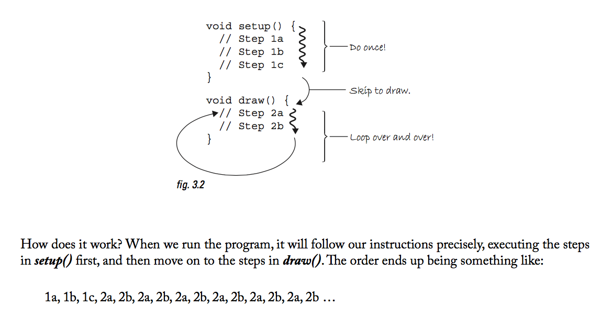

 credits: "Learning Processing" - Shiffman 

When you search for Processing code online, you will almost always see the code structured with a setup() and draw() function - it is Processing's way of helping us to have a consistent structure for drawing with code! Let's look at a few examples:

***NOTE: This is just an intro to the setup() and draw() functions and some of the primitive variables (e.g. mouseX and mouseY, and many more) that become relevant when using looping draw() function. The goal is just to expose you to the possibilities for controlling visual form.***
***
##S10.1:Random fill ellipse

This example just shows how the statements in the draw() function are evaluated continuously while the program is running. Each time the draw() function is called, a NEW RANDOM COLOR is set for the fill color of the ellipse.
	
	// we set our canvas size to 500 by 500 pixels
	void setup() {
	  size( 500, 500);
	  smooth();
	}
	
	// the draw function runs 60 times per second! Each time coming up with a new fill color for the ellipse.
	// only the fill color is changing and not the location of the ellipse 
	void draw() {
	  fill(random(255), random(255), random(255));
	  ellipse(width/2, height/2, 100, 100); 
	}
	
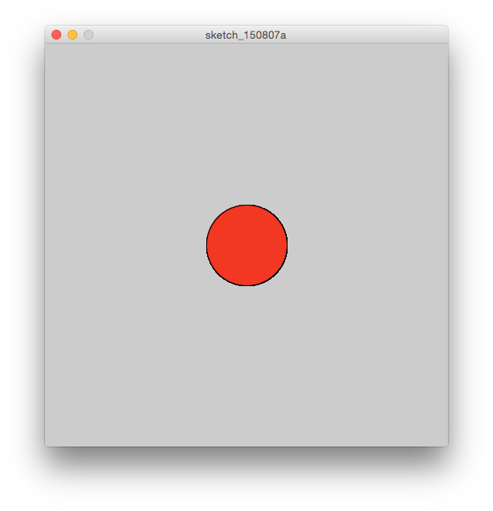

***
##S10.2.1:Enter the Mouse

	void setup() {
	  size( 500, 500);
	  smooth();
	  noStroke();
	}
	
	void draw() {
	  
	  // create a blue fill with transparency
	  fill(0, 0, 255, random(50,100));
	  
	  // make a variable for the radius which calculates a radius for the ellipse based on the speed of the mouse
	  // mouseX is the current screen location of the mouse
	  // pmouseX is the previous screen location of the mouse
	  // thus the absolute difference of the current location minus the previous location is the speed
	  int radius = 50;
	  ellipse(mouseX, mouseY, radius, radius);
	}

##S10.2.1:Enter the Mouse and resetting background

	void setup() {
	  size( 500, 500);
	  smooth();
	  noStroke();
	}
	
	void draw() {
	background(255);
	  // create a blue fill with no transparency
	 fill(0, 0, 255);	  
	  // make a variable for the radius which calculates a radius for the ellipse based on the speed of the mouse
	  // mouseX is the current screen location of the mouse
	  // pmouseX is the previous screen location of the mouse
	  // thus the absolute difference of the current location minus the previous location is the speed
	  int radius = 50;
	  ellipse(mouseX, mouseY, radius, radius);
	}
	
***
##S10.2.1: Visualizing the speed of the mouse

	void setup() {
	  size( 500, 500);
	  smooth();
	  noStroke();
	}
	
	void draw() {
	  
	  // create a random fill with transparency
	  fill(random(100), random(255), random(255), random(50,100));
	  
	  // make a variable for the radius which calculates a radius for the ellipse based on the speed of the mouse
	  // mouseX is the current screen location of the mouse
	  // pmouseX is the previous screen location of the mouse
	  // thus the absolute difference of the current location minus the previous location is the speed
	  int radius = abs(mouseX-pmouseX );
	  ellipse(mouseX, mouseY, radius, radius);
	}
	
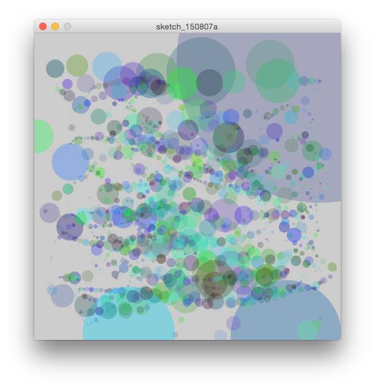

***
##S10.5:A simple animation
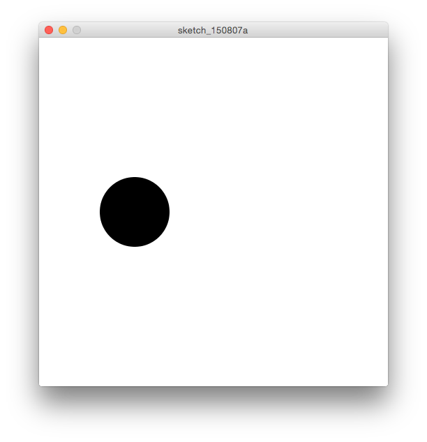

	void setup() {
	  size( 500, 500);
	  smooth();
	  noStroke();
	  
	  // set the frame rate
	  frameRate(60);
	}
	
	void draw() {
		 // reset the background every time the draw function is called to create the illusion of motion
		 background(255);
		 fill(0);
		 // draw the ellipse accros the screen
		 if (frameCount < width/2){
		   ellipse(frameCount, height/2, 100, 100);
		 } 
		 // draw the ellipse animating downward
		 if (frameCount > width/2  && frameCount <width*0.90){
		   ellipse(width/2, frameCount, 100, 100);
		 }
	}
		
***
##S10.4:A simple animation - a bounce back
	// oooh a global variable - sooo shinyyy
	int location = 0;
	
	void setup() {
	  size( 500, 500);
	  smooth();
	  noStroke();
	
	  // set the frame rate
	  frameRate(120);
	}
	
	void draw() {
	  // reset the background every time the draw function is called to create the illusion of motion
	  background(255);
	  fill(0);
	
	
	  // draw the ellipse accros the screen
	  if (frameCount < width) {
	    if (location < width) {
	      location = location +1;
	      ellipse(location, height/2, 100, 100);
	    }
	  } 
	  // draw the ellipse animating downward
	  if (frameCount > width) {
	      location = location -1;
	      ellipse(location, height/2, 100, 100);
	  }
	}

***

 <h2>WOW, we just learned a bunch! Do your brains hurt? Mine too. Let's take some time to let that settle and explore all this new knowledge! </h2> 

***
## Let's make our first program ("sketch")
Using the shapes and properties we just learned, take some time to make a quick first sketch. Use your i-m-a-g-i-n-a-t-i-o-n.   

As some motivation, here's what a few students have made at **NYU's ITP** during their first week learning Processing:
<!--

  ()

-->

 Yu Ji, A miserable crab(http://yuji2015.net/itp/icm-01-a-miserable-crab/)

 Kristina Budelis, A programmed Cat (http://www.kristinabudelis.com/i-programmed-a-cat/)

 Michelle Lin, Geometric Bloom (http://www.whatthebagel.com/2013/09/09/week-1-geometric-bloom/)

 CJ Santa Maria, Dandelion (https://cjsantamaria.wordpress.com/2013/09/10/dandelion-via-processing/)

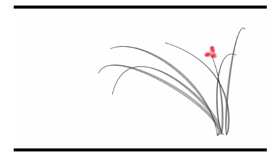

Jiwon Yoon, Orchid (http://www.jiwonyoonworks.com/?p=29)

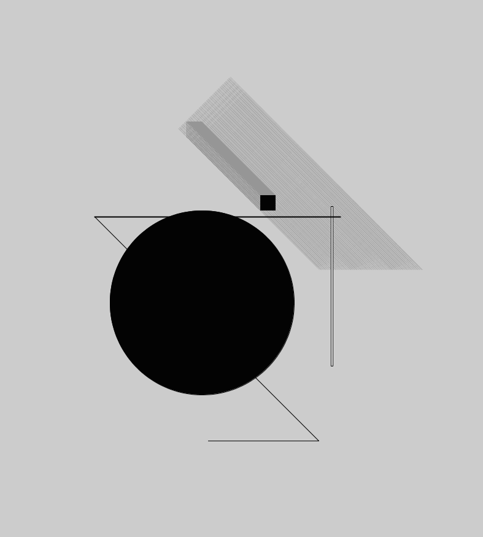

 Joey Lee, my first procesing sketch - copying El Lissitsky's PROUN drawing

(At the end, we'll all go around to see what we've all made)

***

# Recap & Future Directions:
## What we learned today

* The fundamentals of programming in Processing - and programming in general. We covered:
	* Processing's primitive shapes & how to make some of our own.
	* Fundamental Data types
	* Mathematical operations in Processing
	* Variable declarations and assignments
	* Conditionals (if / else if / else) and controlling program flow using logical operators
	* For Loops 
* We learned:
	* That we can program! 
	* How to begin thinking through code - how to break down problems into steps.
	* We need to practice this stuff often to get better. 
* What we didn't learn:
	* We learned a lot of things today, but it certainly is only the tip of iceberg. There are tons of more functions and programmatic control structures we didn't get into today. It will be up to you to learn more about these things. There are a ton of great resources out there which are listed in the references section bewow.
	* Here's a list of some of the major things I think we didn't cover today:
		* Different renderers (e.g. P3D, OPENGL, etc)
		* While loops
		* Arrays, tables, dictionaries, JSON
		* Reading and writing files
		* exporting to PDF or saving frames as PNG
		* sharing your sketch online
		* and the list goes on and on... :)

# Future Directions

## Endless learning
There's so much more to learn and so much cool stuff we haven't yet done with data! Throughout the course I hope you can reference back to this workshop as you learn more about Processing and as a way to help you understand some of the other tools we will be using like R or Mapbox Studio, and others. 

With what you've learned today, you're not so far off from learning how to start visualizing data in Processing. With some practice and perseverence you can start making things like this:

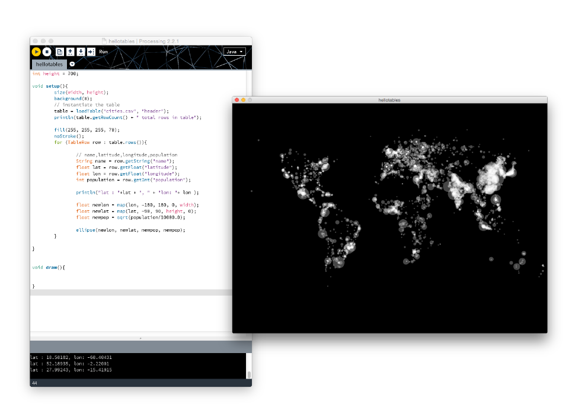

or this (using the Unfolding Library):

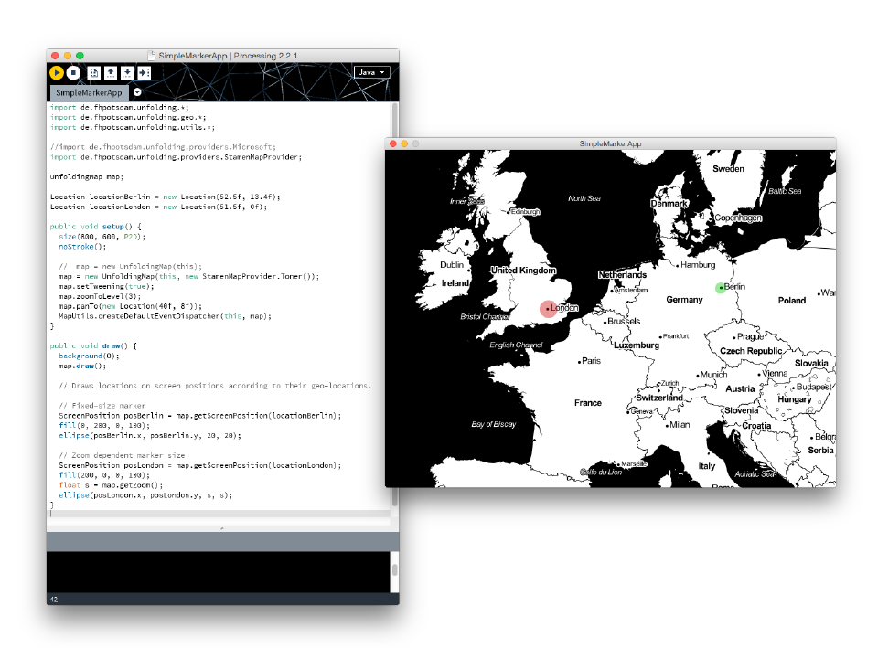

## P5.js
I have to mention P5.js which is the javascript library inspired by Processing not only because it is super cool, but because I, along with many others, believe the age of the web is here!  P5.js is a javascript library that takes the soul of Processing and implements it in javascript meaning that you can sketch with code using web technologies (html, css, & javascript). I would argue that the syntax is friendlier and is more flexible in terms of sharing your work. Besides the fact that the browser can crash if you send it a ton of data, P5.js may be an interesting way to move out of your desktop and onto the web.

*NOTE: I decided not to teach P5.js since I thought introducing html, css, and javascript would be maybe too much for the first class. Please let me know if you have other thoughts!

P5.js website:

http://p5js.org/

P5.js tutorials:

http://p5js.org/tutorials/

# Web Searching 
"Programming is just about how good you are at google searching."

# References

"Processing, A Programming Handbook for Visual Artists and Designers" by Casey Reas and Ben Fry

"Getting Started with Processing" - Ben Fry

"Learning Processing" - Dan Shiffman

# Resources

Learning Processing With Dan Shiffman - this dude is handsdown the best guy ever. 

* Videos:
	*  http://icm.shiffman.net/0.0/
	*  http://hello.processing.org/
* Books:
	* learning Processing: http://learningprocessing.com/

"Programming Handbook for Visual Artists and Designers" by Casey Reas and Ben Fry

* https://processing.org/handbook/	 

P5.js tutorials

* http://p5js.org/tutorials/

"Getting Started with Processing" - Ben Fry

* http://www.amazon.com/gp/product/144937980X?ie=UTF8&tag=benfrycom-20&linkCode=as2&camp=1789&creative=390957&creativeASIN=144937980X

"Visualziing Data " - Ben Fry

* http://www.amazon.com/exec/obidos/ASIN/0596514557/ref=nosim/benfrycom-20

Processing.org

* Reference: https://processing.org/reference/
* web: processing.org

