# An intoduction to R:

## About
This is an intro to the R programming language which we will use throughout the rest of the course and hopefully you'll use when you leave UBC and start working!

## Outline
<!-- START doctoc generated TOC please keep comment here to allow auto update -->
<!-- DON'T EDIT THIS SECTION, INSTEAD RE-RUN doctoc TO UPDATE -->

    - [Getting Comfy:](#getting-comfy)
  - [S1: Why are we learning R?](#s1-why-are-we-learning-r)
  - [S2: Requirements:](#s2-requirements)
- [S3 Getting Started](#s3-getting-started)
  - [S3.1 R Studio IDE:](#s31-r-studio-ide)
  - [S3.2 Focus Things:](#s32-focus-things)
- [S4 "Hello World!"](#s4-hello-world)
  - [S4.1:Comments](#s41comments)
  - [S4.3:Printing](#s43printing)
- [S5: Math](#s5-math)
  - [S5.1:Mathematical operators in R](#s51mathematical-operators-in-r)
    - [S5.1.1: Addition](#s511-addition)
    - [S5.1.3: Substraction](#s513-substraction)
    - [S5.1.4: Multiplication](#s514-multiplication)
    - [S5.1.5:Division](#s515division)
    - [S5.1.6:Exponentation](#s516exponentation)
  - [S5.2:Logical Operators in R](#s52logical-operators-in-r)
    - [S5.2.1: Greater than](#s521-greater-than)
    - [S5.2.2:Less than](#s522less-than)
    - [S5.2.3: Is equal to](#s523-is-equal-to)
    - [S5.2.4:does not equal](#s524does-not-equal)
- [S6: Variables](#s6-variables)
    - [S6.1: Addition](#s61-addition)
    - [S6.2: Multiplication](#s62-multiplication)
- [S7 Data & Plotting](#s7-data-&-plotting)
  - [S7.1 Vectors](#s71-vectors)
  - [S7.2: Lists](#s72-lists)
  - [S7.3 Dataframes](#s73-dataframes)
  - [S7.4 Reading data in as a dataframe](#s74-reading-data-in-as-a-dataframe)
  - [S7.5 Exploring Vancouver Crime Data](#s75-exploring-vancouver-crime-data)
- [S8: Enter, the R packages:](#s8-enter-the-r-packages)
  - [Whew! We've done ALOT. Take a big deeeeep breath, get a snack, maybe some banana bread with chocolate chips, and come back ready to learn more.](#whew-weve-done-alot-take-a-big-deeeeep-breath-get-a-snack-maybe-some-banana-bread-with-chocolate-chips-and-come-back-ready-to-learn-more)
- [S9: What's new in our data viz toolbelt?](#s9-whats-new-in-our-data-viz-toolbelt)
- [S10: What have we done?](#s10-what-have-we-done)
  - [Matrices & Rasters](#matrices-&-rasters)
  - [Revisiting our Crime Example:](#revisiting-our-crime-example)
- [References:](#references)

<!-- END doctoc generated TOC please keep comment here to allow auto update -->

<!--
### Getting Comfy:
1. R ( and computer languages in general) are like more awesome calculators:
	+ basic math operations between single numbers
	+ enter: Print & Plot
	+ introducing vectors
	+ introducing matrices
	+ basic math with vectors / matrices
	+ cool contour/heatmap with matrix
2. Dataframes are your best friend:
	+ understanding dataframes - what are they and why are they awesome?
	+ getting comfy with data frames - let's make one!
	+ let's plot some columns! 
	+ getting more comfy with dataframes - let's load one!
	+ Let's plot those columns! 
	+ basic math operations with dataframes - pretty much the same as with vectors! 
	
3. R packages:
	+ what are they? why are they super awesome? why do they make our lives better in so many ways?
	+ installing
	+ searching for them: web search time! 

4. Control structures / Loops

-->

##S1: Why are we learning R?

Why are we using R after spending all that time learning Processing? Well, first I would go back to the fact that programming languages are like materials, each with a distinct qualities, benefits, and limitations. In this way, it doesn't make sense to say one language is better or worse than another, rather that  they are just different. So why learn R? Here's why I chose to introduce R in this course:

* **High Level Programming Language**: R is what we consider a high level programming language. With a few lines of code, you can do *a lot* of stuff which is super nice when we're learning.
* **Easy to setup and has a nice Integrated Development Environment** (IDE): R is nice because it sort of lives within itself - it is easy to download, install, and setup, it is cross platform (it can be used in Windows, Mac OS, etc), and has a nice IDE called RStudio which we will use to help us write our code.
* **Large user community**: Like Processing, R has a HUGE user community that has grown to include domains of all sorts. This means also if you have a specific question that most likely someone has already found the answer and posted it online. The New York Times Data team is using R (among other things), for example! 
* **Super handy packages**: Because of the large user community people have developed packages for doing all sorts of cool things. Want to make an interactive map? Bam! There's an R package for that. Want to make a hillshade of a DEM in R? There's a package for that too! You'll start to see that packages will be your best friend, so use your favorite search engine and find the right packages for you!
* **Nice plots**: R kicks ass for plotting - and this is a data visualization class after all. With one line of code you can already start looking at your data, add a few more and you already have something pretty to look at. As a way of exploring and displaying your data, R is a nice way to go. 
* **Local expertise**: Its always handy to have people around to help you if you get stuck. There are plenty of people teaching R at UBC and also some expert grad students and faculty in Geography. 
* **Open source mapping**: When we dive further into R we'll start to see that we can start to do some really fancy geoprocessing in R. When you leave UBC and no longer have access to proprietary software, you'll be happy to know that you have the tools to continue mapping away. 

##S2: Requirements:

* First: download and install [R](http://cran.stat.sfu.ca/)
* Second: download and install [R studio](https://www.rstudio.com/products/RStudio/#Desktop) (make sure to install R first!)

#S3 Getting Started

Throughout this workshop, try your best to make connections between what you learned in the intro to Processing to what R has to offer. There are some fundamental differences you will begin to notice, but you'll really quickly begin to see the advantages (and disadvantages) of using R. 

##S3.1 R Studio IDE:

This is the R studio IDE. We will use R studio as our environment for running our code, making our scripts, and viewing our plots. It's sort of like our Processing PDE, with the major difference being that R is an ***interpreted*** language meaning we can run our code line-by-line versus Processing which is ***compiled*** which means Processing runs all of the code at once. You'll see why this is advantages for working with and exploring data. Anyways, because of this key difference, R studio is setup to help us explore our data line-by-line.

Your typical R studio IDE will look like the above and includes:

* **Script window**:A place to put your script (your entire code)
* **R console**: every line of code your run from your script will be run, evaluated and printed here. 
* **Global Environment**: This will show all the variables you declare and assign. The fancy thing about R studio is that it will tell you what kind of variable it is and even let your preview your data that you read in!
* **Plot, Packages, Help, & more**: Your plots will be shown here. Also you will be able to find packages and access R's help documentation.

##S3.2 Focus Things:
+ Print everything - check that things are working and see how you change and manipulate data with functions and operations.
+ Plot everything - again, check that things are working and see how you change and manipulate data with functions and operations.
+ Help your classmates and friends - these will be the people you work with in the future - this is your network! The stronger you guys are and closer you are, the better connections you'll have. 
+ (on the above point) the success of this workshop will be how the group collectively grows and learns so work together!  

#S4 "Hello World!"

##S4.1:Comments

Remember in Processing we used the double forward slashes "//" to make comments for lines of text in our program that we don't want the computer to interpret? Well, R has it's own way of making comments which is the hash "#". 

So let's start our journey into R with a comment saying, "Today I'm going to learn R, [and today's date]"

	# Today I'm going to start my journey with R! 
	# YYYY-MM-DD 

*NOTE: just like in the Processing tutorial, you can copy and paste these bits of code into the script window. 

Cool! So now you know how to make comments in R. These will be handy to remind yourself of the things you've learned and keep track of the flow of your program. 

##S4.3:Printing

The first thing we're going to do is print the classic "hello world!" statement from our **script** window. To practice using comments, let's first make a comment saying, "here's my first conversation with R"

	### --- here's my first conversation with R --- ###

Whoa! What the heck, why are there 3 "#'s" and all that other stuff, aren't we just making a comment? Yes, technically, we could just use 1 "#" and that would be enough but by adding more, we can help add clarity to each section. Remember, anything after the first comment (#) is not evaluated by the computer so we could really put whatever we want after it...Throughout the workshop, play with other ways of helping to make your comments more distinct.

So now we can type our "Hello World!" statement under our fancy comment, like this:

	### --- here's my first conversation with R --- ###
	"Hello World!"

Now, let's "run" this statement by:

1. highlighting the text -->
	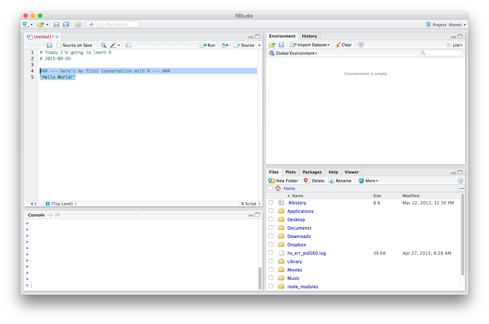
	 
2. On **mac**: [cmd]+[enter] OR On **windows**: [ctrl]+[enter]

If you did this correctly, you will see now in your console window something that looks like this:

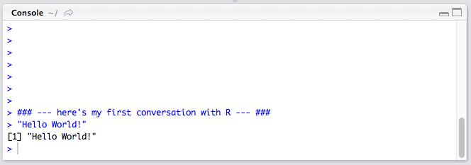

Sweet! You just make the computer say "hello world!" by **running the line of code**. 

You can see that the blue text is our commented stuff - the computer *reads* it but it does not *evaluate* it. But our "Hello World!" text is *run*, *evaluated*, and *printed* to our console. 

Alternatively, we can also use the *print()* function to print some text for us like this:

	# --- heres a nother way to print in R --- #
	print("Hello World!")

Run this and see that it return the same thing! Pretty neat stuff.

**NOTICE SOMETHING? WE DON'T NEED TO USE SEMI-COLONS (;) IN R!** This means that R doesn't use semi-colons to signify the end of a statement in contrast to Processing. Rather R uses line breaks to interpret each statement. Excited? Sad? Indifferent? In any case, just remember you **don't need semi-colons** to end statements in R. Are you beginning to see how programming languages all have their own flavor?

Now that you see how to run code line-by-line, let's dive further into some more exciting stuff.

#S5: Math

Oh la la, everyone's favorite subject: math! If you remember back to the Processing workshop, the mathematical operators allowed us to start doing some really cool stuff with our visuals. While most of the mathematical operators are the same, let's check out those mathematical operators in R again.

##S5.1:Mathematical operators in R

	Operator		Description
	+				addition
	-				subtraction
	*				multiplication
	/				division
	^ or **			exponentiation
	x %% y			modulus (x mod y) 5%%2 is 1
	x %/% y			integer division 5%/%2 is 2

See, not so different from what we already know. We added a few changes and new operators like the **exponentation** and the **modulo which takes two %%**. In any case, let's run a few of them to get warmed up.

Run each of these statements in your script window and see what pops up in the console. But first, let's make a comment in our code showing that this is going to be for math practice!

	# ---------- Practice Make Perfect, especially for Math ---------- #

###S5.1.1: Addition
	
	# here's an example of addition
	3 + 5  

###S5.1.3: Substraction

	# Simple subtraction
	145632 - 67424

Why the big numbers? well, just to show you how easy it is for the computer to calculate these numbers!

You should be seeing the console output :)

###S5.1.4: Multiplication

	# Fancy Multiplication
	6*5
	
	# some more fancy multiplication
	6 * 5 * 3 * 2
	
	# and even more fancy multiplication
	(5 * 2) * 3 * 6

###S5.1.5:Division

	# Simple Division
	50 / 5
	
	# More Division
	50 / (3/4)

###S5.1.6:Exponentation

	# An exponent: method 1
	10**2
	
	# Exponents: method 2
	10^2

Now you know the rest. Let's try some of the logical operators.

##S5.2:Logical Operators in R

	Operator		Description
	<				less than
	<=				less than or equal to
	>				greater than
	>=				greater than or equal to
	==				exactly equal to
	!=				not equal to
	!x				Not x
	x | y			x OR y
	x & y			x AND y
	isTRUE(x)		test if X is TRUE

Again, let's make a comment showing this new section:

	# ---------- Logical Operators in R ---------- #

###S5.2.1: Greater than 
	
	# greater than 
	10 > 3
	
	# greater than
	3 > 10

Oooh, see how the console prints TRUE or FALSE? This is a good sign! 

###S5.2.2:Less than 

	# less than
	3 < 10
	
	# less than
	10 < 3

###S5.2.3: Is equal to

	# is equal to
	5 == 5
	
	# is equal to
	5 == 6

###S5.2.4:does not equal

	# is not equal to
	5 != 6
	
	# is not equal to
	5 != 5

Ok ok, so we get the idea, we've seen this all before. How about getting into some variables? Ain't no thang. Let's do this!

#S6: Variables

So we know how powerful variables are for programming. Let's check out how R handles variables. As always, let's start with an example.

###S6.1: Addition
	
	# ---------- Working with Variables: Addition ---------- #
	# Let's declare a variable called "weather" and assign it to the value of 1
	weather = 1
	
	# let's declare another variable called "salmon" and assign it a value of 7
	salmon = 8
	
	# Let's declare another variable called salmonWeather and assign it to the sum of 'weather' and 'salmon'
	salmonWeather = salmon + weather
	salmonWeather # this will print the value to the console
	
If you got 9, then you're totally crushing this tutorial! **NOTICE: we don't have to declare whether the variable is an integer or a floating type or any type in general!**  This is because R is **not a declarative language**. R makes an assumption or calculates what type of data will be returned from an expression. Love it or hate it, that's how R rolls!

Let's look at another example. Remember the example of Joey's enthusiasm from the Processing workshop? Here's the same thing but in R.

###S6.2: Multiplication

	# ---------- Working with Variables: Multiplication ---------- #
	# Let's declare a variable called "joeysEnthusiasm" and assign it to the value of 1
	joeysEnthusiasm = 100
	
	# let's declare another variable called "classEnthusiasm" and assign it to the product of joeysEnthusiasm * 2
	classEnthusiasm = joeysEnthusiasm * 2
	classEnthusiasm 

So you may have noticed in your **Global Environment** a few things have popped up. Hey, it looks like the variables we just declared, assigned, and computed! The handy thing about R studio's IDE is that it is now keeping track of all the variables that we have created in our program. The more variables you create in your script, the more variables you'll see. 

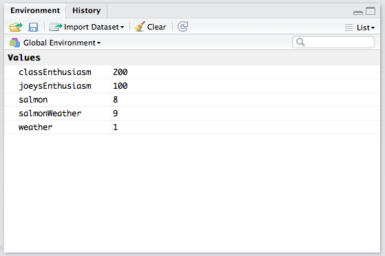

#S7 Data & Plotting

Ok, so here's where things are going to get *very* interesting for us. Enter: data & plotting. In the Processing workshop we learned that "data could be anything from the time of day, the location of a bus stop, the color of your hair, and even the location of your mouse on the screen and the keys you pressed to login to your email. In general, data often consists of measurements of physical characteristics whether it be a digital photo of your dog or the precipitation in Vancouver." 

So far we've only worked with single piece of data by creating variables and assigning a value to them. However, now we're going to start looking at how to work more functionally with data and start taking advantage of R as a data handling, analyzing, plotting swiss army knife. 

If you haven't noticed by now, soon you will see that one of the keys to understanding a programming language is how each language handles data. Begin to understand how data is passed around in a language and before you know it, you'll understand how that language functions. Maybe this piece of advice doesn't make too much sense now, but if you start to get into javascript, python, or dive further into Processing or R, you'll see very quickly that each has a unique data handling model - some nice overlaps as well - that is key for navigating the contours of each language and writing usable, and functional code.

Blah blah blah, Let's start from the beginning. Oh and stay with me, because we're going to introduce the *plot()* function so you can start visualizing your data! 

##S7.1 Vectors

Here's the bread and butter of R programming and data handling - the vector. An R vector is basically a collection of elements of the same datatype (e.g  numeric, character, boolean.)

To create a vector we use the *c()* function and add the elements as parameters to the function:

	# ---------- Data: Vectors ---------- #
	# here's our first vector of integers
	ourFirstIntVector = c(1,2,3,4,5,6,7,8,9,10)
	ourFirstIntVector 
	
	# here's our first vector of floats
	ourFirstFloatVector = c(1.01, 2.04, 3.30, 4.0, 5.0, 6.30, 7.50, 8.0 ,9.0, 10.0)
	ourFirstFloatVector
	
we can also give each element in the vector a name. There are two ways to do this:

	# naming  vector elements:
	ourFirstNamedVector = c(vancouver = 1, toronto = 2, montreal=3, whistler=5)
	ourFirstNamedVector
	
	# naming vector elements with the names() function
	ourSecondNamedVector = c(1,2,3,4,5)
	names(ourSecondNamedVector) = c("vancouver", "toronto", "montreal", "whistler", "chicago" )
	ourSecondNamedVector

Eek! Why are we invoking a function **names()** on the vector and then setting it equal to another vector! Is this blowing your mind??

<!---->

Let's just break this down in plain english:

ourSecondNamedVector = c(1,2,3,4,5)

names(ourSecondNamedVector) = c("vancouver", "toronto", "montreal", "whistler", "chicago" )

* we have a vector of numbers called ourSecondNamedVector
* set the names() of ourSecondNamedVector equal to "vancouver", "toronto", "montreal", "whistler", "chicago" in this order.

If this doesn't make complete sense, it will in a minute. Just hold tight!

**Accessing data by their index** or by their **name**:

We can caccess individual data elements or subsets of elements from a vector either with two methods:

	# Method 1: accessing individual elements:
	ourSecondNamedVector[1] 
	ourSecondNamedVector[2]
	
	# Method 1: accessing a range of elements:
	ourSecondNamedVector[1:2]  
	
	# Method 2: accessing individual elements by name (if it has a name):
	ourSecondNamedVector["vancouver"]

	# Method 2: accessing multiple elements by name:
	ourSecondNamedVector[c("vancouver", "whistler", "montreal")]

Look in the **global environment** notice our variables have been added with the vector? R reads the vectors as "num" or numeric type data. 

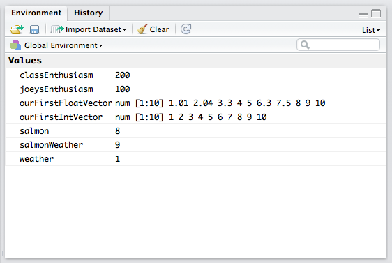

Let's make a list of strings:

	# here's our first vector of strings
	ourFirstStringVector = c("joey", "is", "a", "dork")
	print(ourFirstStringVector)

But what happens if we try to fool R by mixing numeric and string types like this:

	# Here's an attempt at fooling R with a mixed type vector
	ourMixedTypeVector = c(1, 2, 3, "joey", "is", "a", "dork")
	print(ourMixedTypeVector)

Notice that the console output is: "1"    "2"    "3"    "joey" "is"   "a"    "dork". Because **a vector must all be the same type of data**, R automatically converts the numeric elements to the character strings so they match with those other strings like "joey", "is", "a", and "dork". 

SO we know that **vectors mus all be the same type of data**. Very good! Why is this important? Well, vectors are what we call "recursive", meaning that we can apply a function or a mathematical operator on the vector and it will **apply to every element** in the vector. You're probably thinking, "is that even english?" Let's look an example of why vectors are awesome and think about why this could be useful for data handling.

	# ---------- Vectors: understanding what makes them "recursive" ---------- #
	# so we have our variable "ourFirstFloatVector" - let's print it to the console just to check what's inside
	print(ourFirstFloatVector)
	
	# Next let's multiply ourFirstFloatVector by 3
	ourFirstFloatVector * 3

Whaaaat. Every element was multiplied by 3. Why is this super cool? Because in many other languages and/or situations, we would need to write a loop to apply this to each value in collection of elements. Because R is structured to optimally work with data in collections like this, having recursive data objects makes sense!

Ok cool, so hopefully that is sort of starting make sense, so let's keep going and see where this takes us.
	
	# now let's assign a new variable with the product of ourFirstFloatVector and 3
	newFloatVector = ourFirstFloatVector * 3
	print(newFloatVector)
	
	# let's introduce our super awesome plotting function: plot() - let's look at our data!
	plot(x = newFloatVector, y = ourFirstFloatVector)

**Wait, WTF, did a plot just show up on the bottom right of the IDE. NO WAY. ONE LINE OF CODE MADE THIS GRAPH.** The plot is super basic and is missing a lot of elements like a title and proper axis labels, BUT we can already peek into our data.

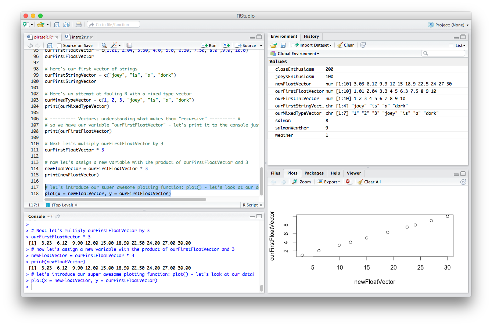
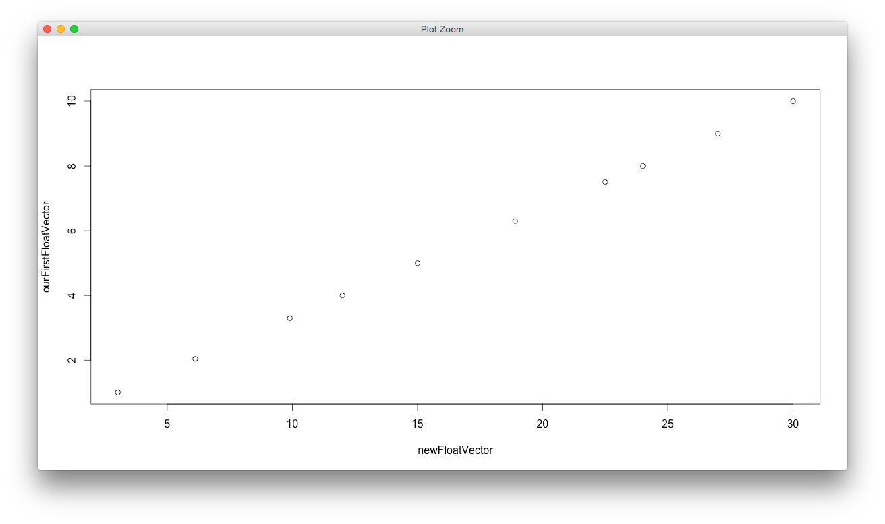 

**Sidenote:**You might also be thinking, "yeah, cool, but I can use Excel to do this..." which is entirely true, valid, and may make sense to do in certain situations, however, as you'll see, it is easy to change parameters and variable values making **reusable and extendible code**. This theme will emerge more and more throughout the course, so just hold on to this idea.

So now, our code to make this plot might look like this:

	# ---------- Vectors: understanding what makes them "recursive" ---------- #
	# so we have our variable "ourFirstFloatVector" - let's print it to the console just to check what's inside
	ourFirstFloatVector = c(1.01, 2.04, 3.30, 4.0, 5.0, 6.30, 7.50, 8.0 ,9.0, 10.0)
	print(ourFirstFloatVector)
	
	# Next let's multiply ourFirstFloatVector by 3
	ourFirstFloatVector * 3
	
	# now let's assign a new variable with the product of ourFirstFloatVector and 3
	newFloatVector = ourFirstFloatVector * 3
	print(newFloatVector)
	
	# let's introduce our super awesome plotting function: plot() - let's look at our data!
	plot(x = newFloatVector, y = ourFirstFloatVector)

At a suuuuuuper basic level, this is what your typical R workflow might look like:

1. load up some data
2. do some operation(s) on it & maybe some statistics
3. plot it! 

At the most fundamental level what is *plot()* doing here? well it is:

1. Takes our newFloatVector as the x values of the graph
2. Takes our ourFirstFloatVector as the y values of the graph
3. Plots them on the plotting window (or think of it as your canvas) as (x, y) pairs, such that these values get mapped to the plot as coordinates:
	
		x: 	3.03  6.12  9.90  12.00 15.00 18.90 22.50 24.00 27.00 30.00
		y:	1.01  2.04  3.30  4.00  5.00  6.30  7.50  8.00  9.00 10.00
		

Remember in Processing we would draw points and ellipses by specifying coordinates on the cavas? Same idea here! 

We will get into more vector operations later but just while we're here, let's just try a few more:

	# ---------- Vectors: understanding what makes them "recursive" - part 2 ---------- #	
	
	# Let's define 2 new vectors
	# vector_x is the months of the year
	vector_x = c(1,2,3,4,5,6,7)
	# vector_y is the  precipitation in mm
	vector_y = c(186, 94, 118, 85, 60, 59, 38)
	
	# Let's declare a variable x_mean and assign it the mean value of vector_y
	y_mean = mean(vector_y)
	print(y_mean)
	
	# let's plot the vector_x and vector_y
	plot(x = vector_x, y = vector_y)

	# and use the abline() function to add the mean precipitation value as a horizontal line to the plot
	abline(h = y_mean)

Whoa, pretty nuts. What did we just do in 6 lines of code? 

* We read in the vancouver's precipitaiton data for January to July in 2014
* calculated the mean precipitation for those months
* and plotted the data and mean value for those months.

Again, the plots are basic looking now, but we're just getting fired up. Also, does anyone else think that maybe a line chart or a bar graph might be more appropriate here??? If so, you're in luck because we will soon learn how to make those too! 

But first, let's learn about the other R data types.
	
##S7.2: Lists

So an R list is a collection of elements (similar to a vector) BUT the key difference is that **a list can contain different data types**. Lists can be created by using the *list()* function and filling in values to be stored in the list. Let's look at some examples here:

	# -------- Lists in R: a list with no keys ---------- #
	myFirstList = list("joey", "is", "a", "nerd", 1, 2, 3, 4)
	print(myFirstList)

Notice that the console prints out each element as the data type you might expect it to be:

	list elements: "joey"		"is"		"a"			"nerd"  	1  			2  			3  			4
	data type: 		character	character	character	 character	numeric		numeric		numeric		numeric

But the great thing about list objects is that they are what we call "Dictionaries" which are data objects with "keys" and "values". A list can thus have many key-value pairs like:

	# -------- Lists in R: a list with keys ---------- #
	listDict = list(apples = 10, instagramFollowers = 5, facebookLikes = 100, supermarket = TRUE, vegetables = "delicious")
	listDict

The console will print out this:

	> listDict
	$apples
	[1] 10
	
	$instagramFollowers
	[1] 5
	
	$facebookLikes
	[1] 100
	
	$supermarket
	[1] TRUE
	
	$vegetables
	[1] "delicious"

Cool so we see that our keys - apples, instagramFollowers, facebookLikes, supermarket, and vegetables - are paired with values - 10, 5, 100, TRUE, and "delicious". 

So let's say we just wanted to know how many instagramFollowers we have. We can use R's dollar sign data selector "$" to specify which data object to return, in this case "instagramFollowers".

	# ---------- accessing data objects in a list ---------- #
	listDict$instagramFollowers

The console will then return:

	> listDict$instagramFollowers
	[1] 5

So why use Lists versus vectors? Well, each has different uses, but one reason might be if you had a *list of lists*. For example, let's say we have a list of the people who just liked your recent twitter post that list might look something like this:

	Ellie:
		Handle: @smellyEllie
		Posts: 134
		location: Vancouver, BC
		Description: "Maps are my lyfe"
	Joey:
		Handle: @leejoeyk
		Posts: 365
		Location: Vancouver, BC
		Description: "Struggling Artist"
	Sally:
		Handle: @sallyseashore
		Posts: 15
		Location: Vancouver, BC
		Description: "Loving Maps since day 1"

We can see that there is a list of names - Ellie, Joey, and Sally - each with a list of properties describing it - Handle, Posts, Location, and Description. How can we make this list in R?

	# ---- a list of lists ---- #
	
	twitterLikes = list( 
		Ellie = list(
				Handle = "@smellyEllie", 
				Posts = 134,
				Location = "Vancouver, BC",
				Description = "Maps are my lyfe"
				),
		Joey = list(
				Handle = "@leejoeyk", 
				Posts = 365,
				Location = "Vancouver, BC",
				Description = "Maps are my lyfe"
				),
		Sally = list(
				Handle = "@sallyseashore", 
				Posts = 15,
				Location = "Vancouver, BC",
				Description = "Loving Maps since day 1")
	)
	print(twitterLikes)
		
Cool! So we just made a list of lists of a data object that we might *actually* see in real life. And we know it worked because it printed out ot the console AND we can see the list now in our global environment:

	> print(twitterLikes)
	$Ellie
	$Ellie$Handle
	[1] "@smellyEllie"
	
	$Ellie$Posts
	[1] 134
	
	$Ellie$Location
	[1] "Vancouver, BC"
	
	$Ellie$Description
	[1] "Maps are my lyfe"
	
	
	$Joey
	$Joey$Handle
	[1] "@leejoeyk"
	
	$Joey$Posts
	[1] 365
	
	$Joey$Location
	[1] "Vancouver, BC"
	
	$Joey$Description
	[1] "Maps are my lyfe"
	
	
	$Sally
	$Sally$Handle
	[1] "@sallyseashore"
	
	$Sally$Posts
	[1] 15
	
	$Sally$Location
	[1] "Vancouver, BC"
	
	$Sally$Description
	[1] "Loving Maps since day 1"

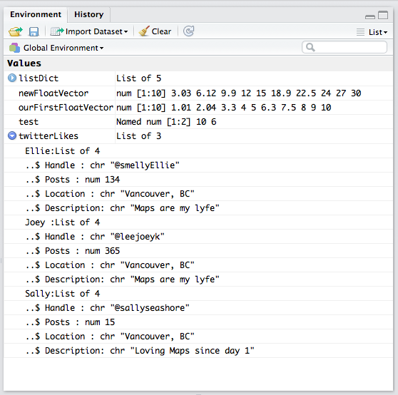

Now how might we access the data for Joey? Well, the handy data selector "$" operator of course!

	# select Joey's data
	twitterLikes$Joey
	
	# select Joey's locaiton data
	twitterLikes$Joey$Location

Cool so it prints out exactly what we would expect. **NOTICE** the use of the data selector "$" to first access the Joey object, then the second "$" to access the Location object of Joey. Now let's do a remix on this by declaring a new variable "joeysProfile" and assigning that data to this new variable

	# select Joey's data and store it to a new variable just for fun
	joeysProfile = twitterLikes$Joey
	
	# Let's access Joey's location from joeysProfile
	joeysProfile$Location

Starting to see why it might be useful to pass data along variables? It may not be super clear now, but try to think about how you process geographic data. Often times, you might want to just take a subset of data by location or by the name of the city or census tract. By using the data selector and storing pieces of data to a new variable, you can only work on the pieces of data you want while preserving the original data!

##S7.3 Dataframes

A dataframe is essentially data in a tabular form (think an excel spreadsheet) - it is composed of rows and columns of equal length. Each column is a **vector**, meaning it contains all of the same data type (except for the header row) and is recursive, meaning that we can apply functions and mathematical operations on each column.  **Holy guacamole, does this mean R is really great at processing tabular data like excel sheets, csv files, and maybe even shapefiles? Yes!** That is exactly right! Let's learn about them!!

In this section we'll first make our own dataframe and then **learn how to read in data from an external file**. Hold on to your socks friends, its going to get SO super cool.

** Our first dataframe**
In this example we'll explore the different elements of a dataframe and why it is super handy for the kind of data we generally work with.

	# --------- Our First Dataframe Example -------- #

As we learned above a dataframe is composed of vectors. So let's make a few vectors first:

	# a vector of fruits
	fruits = c("apples", "oranges", "mangosteens", "lychees", "blueberries")
	
	# a vector of colors of each fruit
	color = c("red", "orange", "purple", "red-green", "blue")
	
	# a vector of descriptions
	descriptions = c("crunchy", "juicy", "wonderful", "exotic", "the best")
	
	# a vector of how many I've eaten this week
	quantityEaten = c(0, 2, 0, 0, 1000)
	
Now we have our vectors, we can simply add them as parameters into the **data.frame()** function:

	# a dataframe of the fruit related vectors
	fruitBasket = data.frame(fruits, color, descriptions, quantityEaten)

So if everything worked out, you will see in your global environment the *fruitBasket* dataframe has been added!

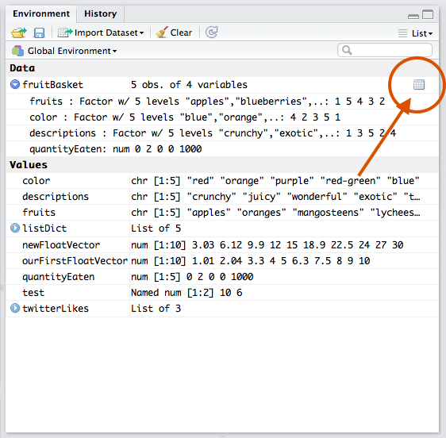

If you click on the little icon that looks like a data table, you will get a preview of that dataframe like this:

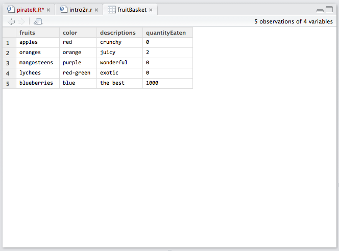

**YOU JUST MADE YOUR FIRST DATA TABLE** And now you know how many blueberries I've eaten. 

**Properties of Dataframes**

* **colnames()**: use the *colnames()* function to get the names of the columns in the dataframe:

		# get the column names of our fruitBasket dataframe
		colnames(fruitBasket)    # console prints: "fruits"        "color"         "descriptions"  "quantityEaten"

* **Access data columns with selector "$"**: Just like we accesed data in our list type data, we use the $ selector to get specific columns in our dataframe

		# get the fruits in the dataframe:
		fruitBasket$fruits

		# get the quantityEaten in the dataframe:
		fruitBasket$quantityEaten		

		# use the plot() function on the data you selected:
		plot(fruitBasket$fruits, fruitBasket$quantityEaten)

Nice! We just plotted our data directly pulled from our dataframe! Feeling the love yet? If yes, then get ready for more, if not, then let's try a **real-world data** example.

##S7.4 Reading data in as a dataframe

We've learned how to make our own data, but the reality is that we're going to be pulling in data generated from some process from somewhere in the world. This could be a table of anything such crime data, the available apartments for rent in Vancouver, or air pollution data. How do we bring this tabular data into R? We can use these table reading functions from [R](https://stat.ethz.ch/R-manual/R-devel/library/utils/html/read.table.html):

	read.table(file, header = FALSE, sep = "", quote = "\"'",
	           dec = ".", numerals = c("allow.loss", "warn.loss", "no.loss"),
	           row.names, col.names, as.is = !stringsAsFactors,
	           na.strings = "NA", colClasses = NA, nrows = -1,
	           skip = 0, check.names = TRUE, fill = !blank.lines.skip,
	           strip.white = FALSE, blank.lines.skip = TRUE,
	           comment.char = "#",
	           allowEscapes = FALSE, flush = FALSE,
	           stringsAsFactors = default.stringsAsFactors(),
	           fileEncoding = "", encoding = "unknown", text, skipNul = FALSE)
	
	read.csv(file, header = TRUE, sep = ",", quote = "\"",
	         dec = ".", fill = TRUE, comment.char = "", ...)
	
	read.csv2(file, header = TRUE, sep = ";", quote = "\"",
	          dec = ",", fill = TRUE, comment.char = "", ...)
	
	read.delim(file, header = TRUE, sep = "\t", quote = "\"",
	           dec = ".", fill = TRUE, comment.char = "", ...)
	
	read.delim2(file, header = TRUE, sep = "\t", quote = "\"",
	            dec = ",", fill = TRUE, comment.char = "", ...)

Whoa, we've got 5 different options and a whole slew of parameters we can use to add data in. In general, you will have to pick which function is most appropriate for your input data, but you will learn as you go on which function is right for your data. For now, we will use the **read.csv()** function to read in our data **because our input data in  this case is a comma-separated-values (.csv) file**. 

##S7.5 Exploring Vancouver Crime Data

In this example we're going to read in some data and plot the location of the different crimes.

	# ----------- Reading in Data from a csv ---------- #
	crime = read.csv(file = "/Users/Jozo/Dropbox/UBC/_RA/GEOB472/workshops/02_PiratesCodeInR/data/van_crime_2013_geo.csv", header = TRUE) 
	print(crime)
	
	#  Plot the crime latitude and longitude coordinates just to check out what's inside. 
	plot(x= crime$lon , y = crime$lat) 

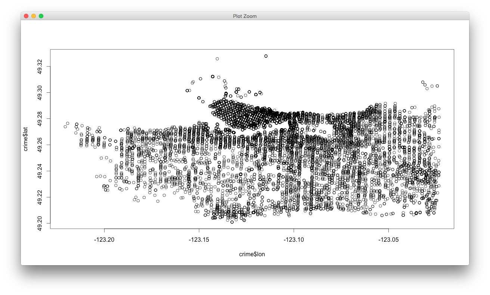

Nice! R understands us! We took our longitude and latitude of the crimes and plotted them! This looks like Vancouver :) Our first geo-ish visualization! Let's dive into some more of the plotting capabilities.

Right now our plot has a bunch of empty circles visualizing all of the crimes. Let's see what types of crimes have been committed. We can take advantage of the recursive nature of the dataframe to calculate the **unique types of crime** in our data. We can do so by using the *unique()* function.

	# For all of the records in crime$TYPE, give me the unqiue ones.
	unique(crime$TYPE)

The console will return:
	
	> unique(crime$TYPE)
	[1] Commercial Break and Enter  Theft Of Auto Over $5000    Theft From Auto Under $5000
	[4] Mischief Under $5000        Theft Of Auto Under $5000   Theft From Auto Over  $5000
	[7] Mischief Over $5000 

Ok, cool, so now let's **subset** out "classes" of crimes. In this case, let's we can see that there are 3 major classes of crimes:

1. Commercial Break & Enter
2. Auto Related Theft
3. Mischief Related Crime

 To do this, we can use the *subset()* function. 

	# subset crimes that are "Mischief Over $5000" or "Mischief Under $5000".
	mischief = subset(crime, crime$TYPE == "Mischief Over $5000" | crime$TYPE == "Mischief Under $5000")
	
	# subset crimes that are commericial break and enter
	breakins = subset(crime, crime$TYPE == "Commercial Break and Enter")
	
	# subset auto crimes
	autocrimes = subset(crime, crime$TYPE == "Theft Of Auto Over $5000" | crime$TYPE == "Theft Of Auto Under $5000" | crime$TYPE == "Theft From Auto Over $5000" | crime$TYPE == "Theft From Auto Under $5000" )

Oof, that's a lot. Let's break this down one of these statements:

mischief = subset( crime , crime$TYPE == "Mischief Over $5000" | crime$TYPE == "Mischief Under $5000" )

1. in the dataframe called crime 
2. **if** the crime$TYPE is equal to "Mischief Over $5000" OR if crime$TYPE is equal to  "Mischief Under $5000", **then** subset() it.
3. and assign it to the "mischief" variable. 

<!---->

Now that we've subset all the different crimes, let's plot them to see where they are:

	# First set the canvas by plotting of the three classes of crimes. In this case, let's first use the auto crimes and color them red.
	plot(x = autocrimes$lon, y =autocrimes$lat, col="red", pch=21)
	
	# Use the points() function to add the "commercial break & enter" and "mischeif"
	# breakins
	points(x= breakins$lon, y=breakins$lat, col = "green", pch=21)
	
	# mischief
	points(x= mischief$lon, y = mischief$lat, col = "blue", pch=21)

So why do we have 1 *plot()* function and then two *points()* functions? So the way it works in R plot plotting is:

1. call the *plot()* function on a set of data to set the canvas
2. call the *points()* function to **add points to the plot**
3. (similarly if we wanted to add lines, we could call the *lines()* function)

Hmm this is ok, BUT we notice that there are a lot of overlapping points. How about adding some transparency? Luckily we know how to do this already. Remember in processing how we could add transparency by adding an alpha channel to a rgb color? Looks a bit like this: (R, G, B, A), EXCEPT in R, we substitute 255 with 1. (R uses a 0 to 1 scale == to 0 to 255), weird, I know, but we have to roll with it ;)

	# ---------- Making our plot more readable by adding transparency ---------- #
	# First set the canvas by plotting of the three classes of crimes. In this case, let's first use the auto crimes and color them red.
	plot(x = autocrimes$lon, y =autocrimes$lat, col=rgb(1, 0, 0, 0.5), pch=21, cex=0.5, ann=FALSE)
	
	# Use the points() function to add the "commercial break & enter" and "mischeif"
	# breakins are green
	points(x= breakins$lon, y=breakins$lat, col=rgb(0, 1, 0, 0.75), pch=21, cex = 0.5)
	
	# mischief is blue
	points(x= mischief$lon, y = mischief$lat, col=rgb(0, 0, 1, 0.5), pch=21, cex=0.5)
	
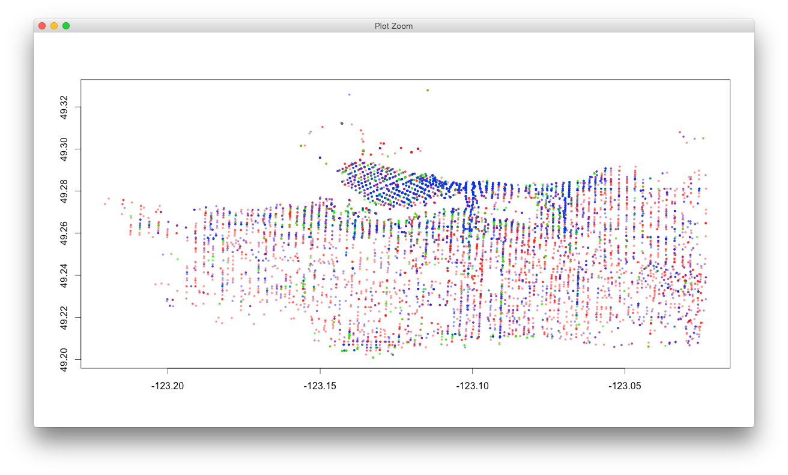

We introduced a few new plotting parameters here namely:

* **pch**: this is the type of point that is drawn. you can see all the types [here](http://www.endmemo.com/program/R/pchsymbols.php)
* **cex**: this is for scaling the size of the point. Since our points were too big before, we scaled them by "0.5" times.
* **col**: as you can see, we can change the color in a number of ways like specifying a color "red" or "green", for example or using RGB or we can use hex color codes.
* **ann**: this stands for annotation. We set this to false here because we don't want R to automatically add the x and y axis labels since we will add them in later.

To finish off this example, let's add a legend and a title and proper axis labels. 
	
	# a legend that includes our color coordination.
	legend( x="topleft", 
        legend=c("Auto Crimes","Commerical Breakins", "Mischief"),
        col=c("red","green", "blue"), pch=21, bty = "n", cex=0.75)

	# title, axis labels:
	title(main="Vancouver Crime Data", sub="a first exploration",
	xlab="longitude (decimal degrees)", ylab="latitude (decimal degrees)")

So in total our final code for the plot will look like this:

	# First set the canvas by plotting of the three classes of crimes. In this case, let's first use the auto crimes and color them red.
	plot(x = autocrimes$lon, y =autocrimes$lat, col=rgb(1, 0, 0, 0.5), pch=21, cex=0.5, ann=FALSE)

	# Use the points() function to add the "commercial break & enter" and "mischeif"
	# breakins are green
	points(x= breakins$lon, y=breakins$lat, col=rgb(0, 1, 0, 0.75), pch=21, cex = 0.5)
	
	# mischief is blue
	points(x= mischief$lon, y = mischief$lat, col=rgb(0, 0, 1, 0.5), pch=21, cex=0.5)
	
	# a legend that includes our color coordination.
	legend( x="topleft", 
	        legend=c("Auto Crimes","Commerical Breakins", "Mischief"),
	        col=c("red","green", "blue"), pch=21, bty = "n", cex=0.75)
	
	# title, axis labels:
	title(main="Vancouver Crime Data", sub="a first exploration",
	      xlab="longitude (decimal degrees)", ylab="latitude (decimal degrees)")
	      
And en fin, our graph looks like this:

BUT wait wait wait, we just have a bunch of points on a graph, but no background or context. As map people we know this maps is just half baked. What could be do to fix this? **Add some contextual geo data behind it of course!**

#S8: Enter, the R packages:

R packages (aka libraries) may be one of the most useful things about R. Libraries are basically bundled up scripts that people (software developers, researchers, designers, artists, etc) have written to help take complicated tasks or computations, wrapped up in simple(r) to use functions to make programming easier, more fun, and easy to read. 

In this way, you can say that Processing is a language and also a "library" because it makes functions available (e.g. ellipse() and rect()) which would take 10 to 20 lines of code in Java and puts them into an easy to use function.

In R, we have countless numbers of libraries to help us to tasks. Remember earlier I mentioned that there are R packages that can help you do geoprocessing and even make your own interactive web map? Well, now we're going to introduce a package that allows us to **read in shapefile** into R so that we can use it as a basemap for our crime plot. 

**NOTE: It may seem like R libraries are just doing magic behind the scenes, but they are simply making more functions available to you to use that aren't already included in the base R library - think of it as an actually library, you go there to get books that you don't have at home ;)** 

SO to start, we need to **install** the package we want to use. After doing a few google serches, I found an R package called "maptools" that allows us to read shapefiles into R and also do some other cool things like make choropleth maps. 

We install packages in R by using the *install.packages()* function:

	# ---------- Using our first R package to display a shapefile! ---------- #
	# install the maptools library
	install.packages("maptools")

After we install our R package, we need to import it to our script. We do so using the *library()* function:
	
	# import the maptools functions by calling the library() function
	library(maptools)

Now that we have our library imported, we have can read in some shapefiles that are conveniently sitting in our data folder. Similar to how we read in our .csv file, we just have to include the path name to each of our .shp files.

Using the maptools library we can use the *readShapeSpatial()* function to read in our data:
	
	# read in our baselayer shapefules with the readShapeSpatial() function
	# metro vancouver shapefule
	vancity = readShapeSpatial("/Users/Jozo/Dropbox/UBC/_RA/GEOB472/workshops/02_PiratesCodeInR/data/shp/metrovan.shp")
	# the block outlines - gives the effect of roads
	parcels = readShapeSpatial("/Users/Jozo/Dropbox/UBC/_RA/GEOB472/workshops/02_PiratesCodeInR/data/shp/vanparcels.shp")

Now our data is loaded - which we can see in our global environment - and it is time to add them to our plot.

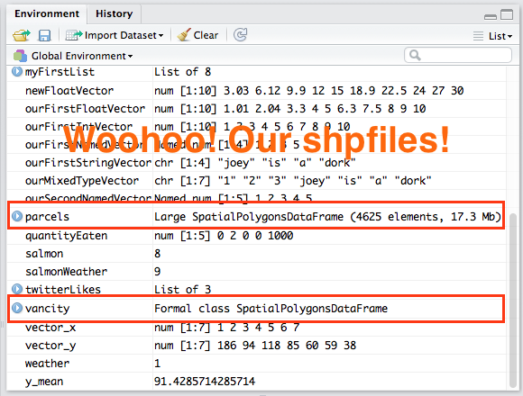

**FIRST - Plot the vancity object:** First we want vancity to be our baselayer ontop of which we will put our points.

	# plot the metrovancouver shapefile as our baselayer
	plot(vancity, 
		xlim=c(-123.27, -123.0), 
		ylim = c(49.25, 49.26), 
		col="#FFFFFF", 
		border=FALSE, 
		bg="#000000")

OK, so we've added some new plotting parameters. Nothing we can't handle. What are they?

* **xlim**: the bounds in the x-coordinate direction. 
* **ylim**: the bounds in the y-coordinate direction.
* **border**: we don't want a border color here, so we set it to FALSE
* **bg**: stands for background. This is the color of the background which we set to black here.

Having the metor vancouver boundaries is nice, but how about adding some of the parcel boundaries to give us a nice effect of the roads and their road width. 

	# plot the parcels as our faux-street effect
	plot(parcels, 
		add=TRUE, 
		col="#FFFFFF", 
		border="#000000")

We also see a new parameter called **add=TRUE** - This allows us to add our parcel plot **ontop of the vancity plot**. 

Now we will add our points on top of the map:
	
	#autotheft
	points(x = autocrimes$lon, 
	       y =autocrimes$lat, 
	       col=rgb(1, 0, 0, 0.75), 
	       bg=rgb(1, 0, 0, 0.15), 
	       pch=21, 
	       cex=0.75)
	
	#breakins
	points(x= breakins$lon, 
	       y=breakins$lat, 
	       col=rgb(0, 1, 0, 0.75), 
	       bg=rgb(0, 1, 0, 0.15), 
	       pch=21, 
	       cex = 0.75)
	
	# mischief is blue
	points(x= mischief$lon, 
	       y = mischief$lat, 
	       col=rgb(0, 0, 1, 0.75), 
	       bg=rgb(0, 0, 1, 0.15), 
	       pch=21, 
	       cex=0.75)
	
	# a legend that includes our color coordination.
	legend( x="topleft", 
	        legend=c("Auto Crimes","Commerical Breakins", "Mischief"),
	        col=c("red","green", "blue"), pch=21, cex=.75)
	
	# title, axis labels:
	title(main="Vancouver Crime Data",
	      xlab="longitude (decimal degrees)", ylab="latitude (decimal degrees)")

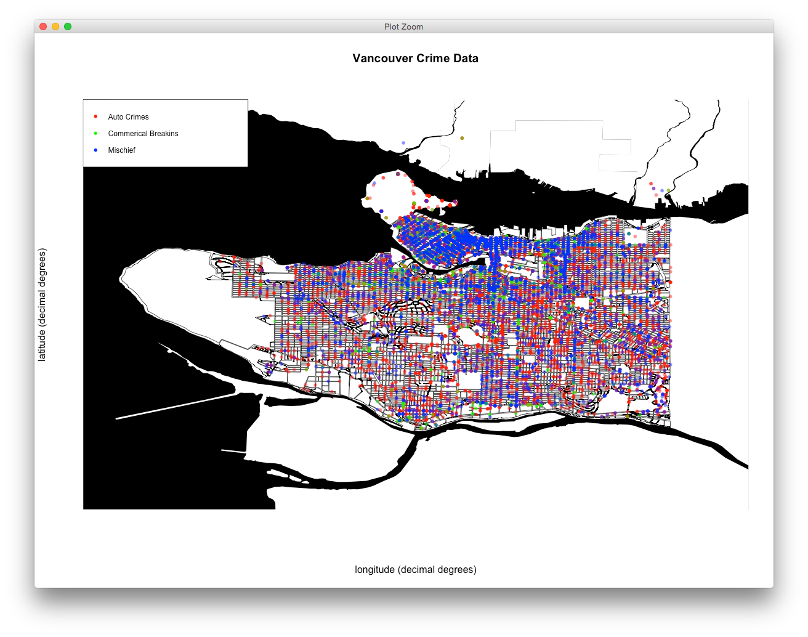

And maybe in the end showing all the points together doesn't make so so much sense... how about small multiples? 

**Before we end** let's **export our crime data to a shapefile**:

Using the maptools's function *SpatialPointsDataFrame()*, we can convert our crime dataframe to a shapefile, but to do so, we need to know what parameters are this function takes to go **from dataframe** to **SpatialPointsDataFrame**.

At the most basic level the SpatialPointsDataFrame() takes 2 parameters:

* First: a dataframe of coordinates (lat, lon)
* Second: the data from the dataframe we're converting

Let's take the first part - making a dataframe of coordinates

	# create a variable called "crime_coords" and assign it a dataframe of the lon and lat coordinates of the crime dataframe
	crime_coords = data.frame(crime$lon, crime$lat)

Now we can take the **coords** object and feed it into our **SpatialPointsDataFrame()** function

	# now create the SpatialPointsDataFrame assigning it to a new variable valled "crime_spatial"
	crime_spatial = SpatialPointsDataFrame(coords = crime_coords, data = crime)
	
Lastly, we can "write" our **crime_spatial** object out to a shapefile using the maptools function *writeSpatialShape()** which takes our *crime_spatial* SpatialPointsDataframe and the file path to where we want to save it.

	# Use the maptools function writeSpatialShape()
	writeSpatialShape(crime_spatial, "insert/your/output/path/name/here/file.shp")

Now check your folder and see that now you have a .shp file of your crime data there! 

As a first independent exercise, how about you take the code from above and tweak it to make individual maps of the 3 crime classes as we see below - change the colors, the type of points, the background and parcel colors. 

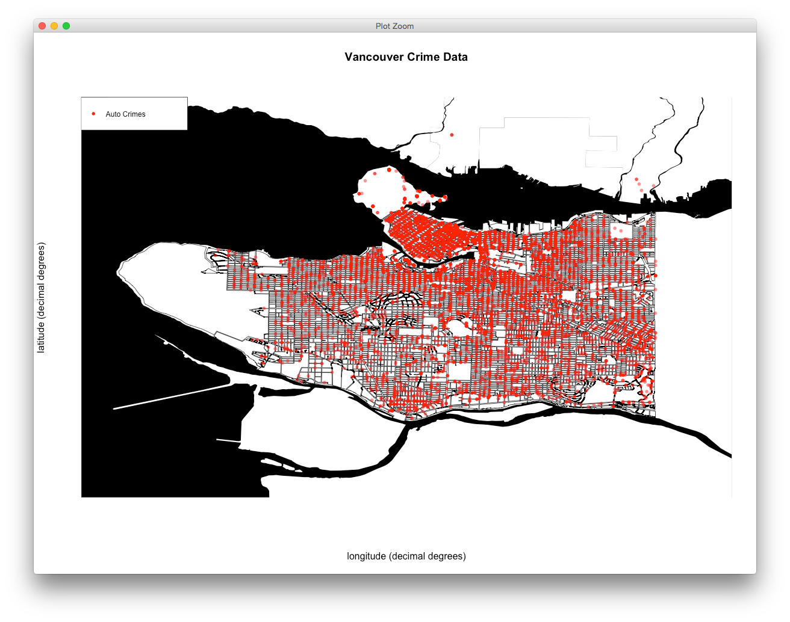
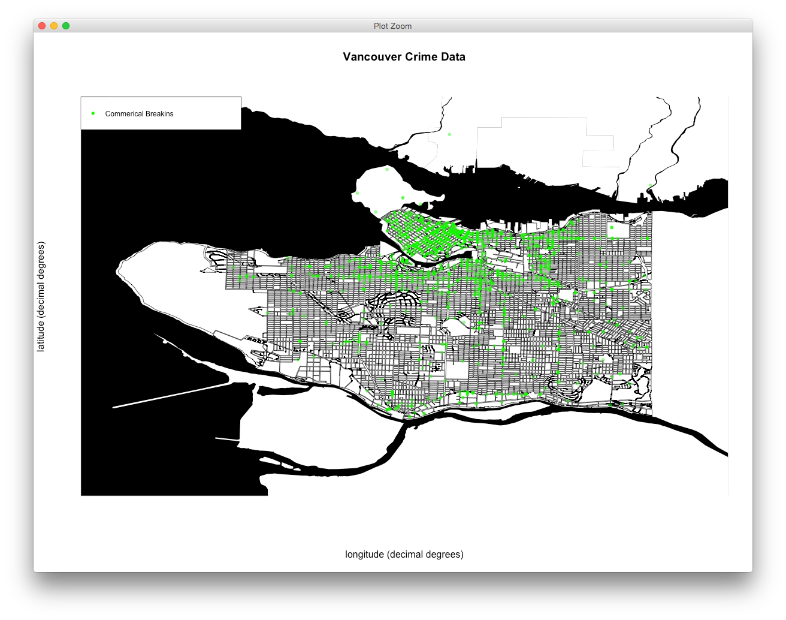

Notice how it is much easier to decipher where each of the crimes is occuring? The auto crimes seem to be prevalent everywhere in Vancouver, especially downtown. The Commerical breakins are clustered where there are commercial areas in Vancouver, but hmm, interestingly not much seems to be happening in Kits? Most of the mischief is maybe happeing in downtown and hastings-sunrise? 

<h2>Whew! We've done ALOT. Take a big deeeeep breath, get a snack, maybe some banana bread with chocolate chips, and come back ready to learn more.</h2> 

***
#S9: What's new in our data viz toolbelt?

* Mathematical and logical operators in R
* R vectors, lists, dataframes
* Plotting!
* Installing and adding R packages
* Using new functions from imported R packages

#S10: What have we done?

* You know know how to read different types of data into R
* You can successfully navigate tweaking visual parameters
* You were able to **subset and aggregate data** and make clear visuals of different crime types in Vancouver. 
	* THIS IS SUPER KEY: you made a decision about what types of data (e.g. crimes) were related and **aggregated** them into a related group so that it is easier for our brains to understand. In this case you grouped the crime types so that instead of having to visualize 7 different types of crime, we can instead visualize 3. 
	* Remember this: "Overview first, details on demand" - we start our data viz story with the overview - here's the 3 major classes of crimes happening in Vancovuer spatially. What about temporally? The next steps of the data viz pipeline are to dive in an start pulling out more info about what's going on. For now, well done, you've started to peak the viewers interest ;)

***

## Matrices & Rasters

## Revisiting our Crime Example:

	require(MASS)
	dens = kde2d(crime$lon, crime$lat, n=100)
	
	plot(vancity, 
     xlim=c(-123.27, -123.0), 
     ylim = c(49.25, 49.26), 
     col="white", 
     border="grey", 
     bg="#FFFFFF")

	contour(dens, levels = c(0,10, 25, 50, 100, 200, 500, 800), add=T)
	
	# enter the third dimension
	persp(dens, expand=0.3, theta =0, phi=75, box=F, shade=0.75)

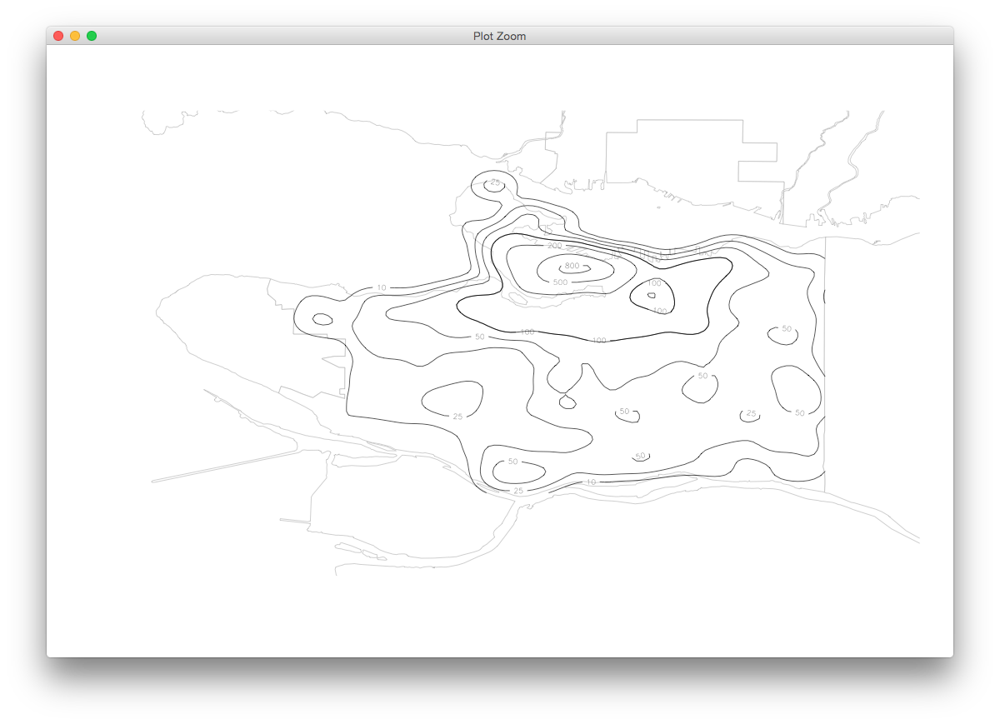

# References:

https://www.nceas.ucsb.edu/scicomp/usecases/ReadWriteESRIShapeFiles