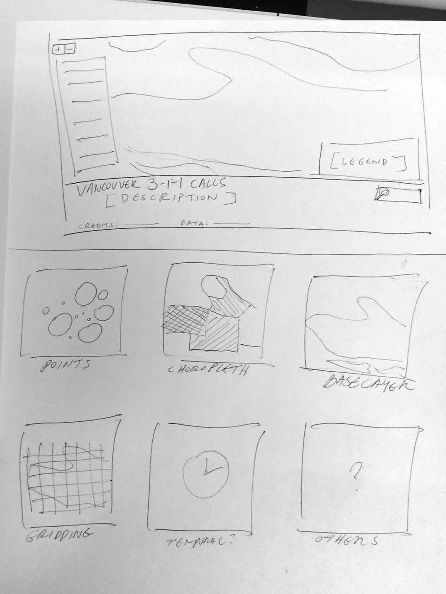

# The Data Viz Pipeline: Vancouver's 3-1-1 phone calls

## About

In this 2-week workshop, we will go through the basic components of the data visualization pipeline. At the end of this exercise in data wrangling, filtering, mining, visualizing, and interacting, we will have a project that we will build - as a group - a visualization that allows people to explore Vancouver's 3-1-1 data on the web. This will be a collaborative experience and **you will need to work in groups and across groups** to come up with a coherent and beautiful interactive piece. 

## Overview

Every month, the City of Vancouver publishes all of the 3-1-1 maintenance request data as .csv files for people to download and examine, however, they do not provide any tools that allow people to look into the data in an easier way. In the name of **civic technologies**, it looks like we have a job to do! What are Vancouverites complaining about? What parts of the city need the most attention? Which requests are getting answered? Which ones are being neglected? Do the complaints change over time? How does it vary spatially? Are some neighborhoods louder than others? Do some neighborhoods have worse streets? These are just some of the questions that we will look into and find visualization solutions for. 

As a guide to help us understand our process through this exercise, we use Ben Fry's data viz pipeline to help us structure the requirements and implementation of this project. 

* **Aquire**: 
	* Where can we get the 3-1-1 data? What is the file format?
* **Parse**:
	* How do we read the data and structure it in a way that we can use/or that we are familiar with?
	* Is the data ready to use or are there certain operations we must to do "spatialize" it?
* **Filter**:
	*  What data do we decide to keep or omit? What rules are you applying and why?
	* How do our steps in the parsing step affect our data? Does it create some data we should omit? How do we know we should filter these data?
* **Mine**:
	* All of these questions are fair game. 
		* What are Vancouverites complaining about? 
		* What parts of the city need the most attention? 
		* Which requests are getting answered? Which ones are being neglected? How long on average does it take? Or is the median response time more valid?
		* Do the complaints change over time? How does it vary spatially? 
		* Are some neighborhoods louder than others? Do some neighborhoods have worse streets? 
	* How do we look into these spatial/temporal/aspatial aspects of the data? 
	* Think about ways of aggregating and classifying data to make our data more readable and understandable.
* **Visualize**:
	* In what ways can we visualize our data? How do we use visualization as a tool to explore our data as well as communicate information about it?
	* It will be important to sketch, draw, wireframe, and prototype your ideas. 
* **Refine**:
	*  Take those sketches, drawings, wireframes, and prototypes and make them engaging and readable. 
	* Focus on clarity. 
	* Bring all of the components of the visualization together
	* make sure you have clear documentation and understanding of your process.
* **Interact**:
	* How are people interacting with the visualization? Are some things more effective than others? 
	* What will people use this for? 

## Roadmap

There are a bunch of steps we will go through to make our visualizaiton. We'll use a number of different technologies and methods to go from our **raw data** to an **interactive map**. There are a million ways we could do this, so we're just going to choose one given our current knowledge and toolbelt. Remember, this is going to be extremely collaborative, so don't worry if you don't understand everything - everyone has their strengths so its up to us to use those strengths to make something really cool.

