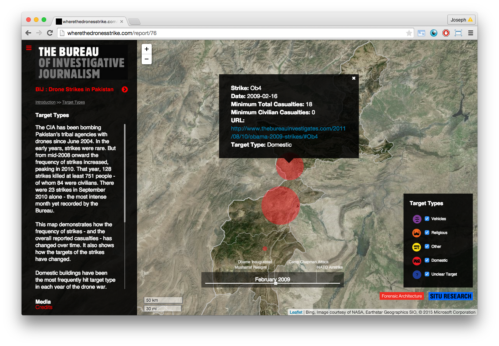

**Aquire** --> **Parse** --> **Filter** --> **mine** --> refine --> represent --> interact

___

# If (data != .shp){ ... } 
## Acquiring, Parsing, Filtering, and Mining all sorts of geographic data.

***Nearly 90% of the cartographic/data visualization process is spent wrangling it into a format that you can understand and use for your projects. This includes acquring, parsing, filtering, and mining the data.***

### About

Have you ever wondered how people make images like this from Twitter and Flickr data?

Or How about web applications showing drone strike bombings in Pakistan?

Up to this point, we've mostly worked with nicely curated data in the form of shapefiles (.shp)
or raster files (e.g. geotiffs, .asc, etc). However, these data in these particular file formats only represent a small fraction of all the types of geographic data currently being generated. As GIS technologists, data scientists/researchers/journalists, data artists, etc one of your most important tools is to know what types of data exist and how to use them to answer your question (or ask more questions). In this workshop, we'll learn about several new types of data and how to use them, namely:

+ Javascript object notation (JSON) 
+ Keyhole markup language (KML)
+ Comma separate values (CSV, TSV)
+ EXtensible Markup Language (XML)
+ others

These data are increasingly common, especially with the growing number of web based Application programming interfaces (APIs) which generate web friendly data formats (e.g. JSON). Examples include those data from Twitter, Facebook, Instagram, Car2Go, etc. 

Building off what we learned in the "Getting Comfy with R" Workshop, let's not only explore how we can use R to perform our data processing of nicely packaged GIS data, but also use R to fix broken data or read and convert data into formats best suited to our needs.

### Workshop Topics Covered:
***Exploring the dataverse:***

1. What other types of geographic data are there? Knowing how to spatialize your data.
2. Converting between file formats.
3. Introduction to APIs 
4. Introduction to getting data from OpenStreetMap. 

***Spatializing your data:***

1. Common data manipulation methods:
	+ table joins (spatial joins)
	+ Merge
	+ concatenations
	+ group by / aggregations
	+ subsetting (spatial subsetting)
2. Gain an appreciation for the terms used for these operations - so you know what search terms to look for in the future!
3. Automation and Iteration

### What You'll Need:

** Be sure to download R first, then R studio. 

+ The latest version of [R](http://www.r-project.org/) 
+ The latest version of [R Studio](http://www.rstudio.com/)
+ [QGIS](http://www.qgis.org/en/site/)
+ A nice text editor such as sublime text, text wrangler, etc.

### Assignment (to be started in class)

+ Find 3 APIs whether they are open access or require and API key and bring the list with your to the next class and why that API is interesting to you / what data you're interested in examining. 
+ Find 3 interesting datasets and convert them to another data format. 
+ Visualize the datasets and describe your process. 

+ Perform each of the common data manipulation methods with a unique data set and document your process. 
+ Iterate a function over your data to change it in a meaningful way
+ Perform a loop to automate a repetitive task. 

    